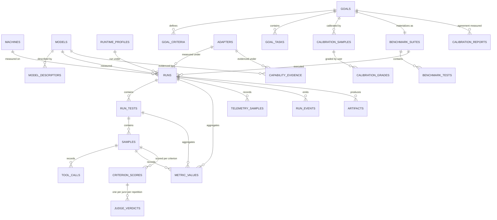
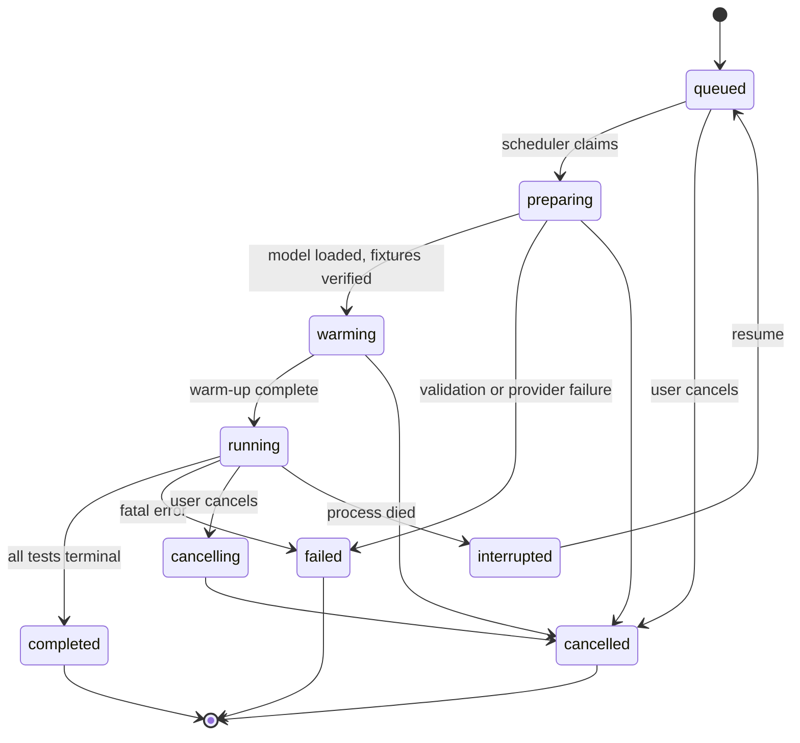

# FreeWeight — Data Model

**Database:** `freeweight.sqlite3` (or a PostgreSQL database), owned exclusively by FreeWeight.
**Corrected 2026-08-21** by the [final architecture audit](../../reviews/final_architecture_audit.md):
ADR-0022 (evidence contract), ADR-0027 (telemetry split, target GPU), ADR-0028 (prompt subset hash).
**Conventions:** [Database Standards](../../standards/database-standards.md) — ULID primary keys,
`snake_case`, units in names, timezone-aware UTC timestamps, enforced foreign keys, `NULL` + reason
for unavailable measurements.

---

## 1. Entity overview



---

## 2. Tables

### `machines`
Static machine identity. One row per fingerprint.

```text
id ULID PK · machine_fingerprint TEXT UNIQUE NOT NULL · hostname · nickname · os_name · os_version
kernel · architecture · cpu_model · physical_cores · logical_cores · ram_bytes
gpus_json · storage_json · python_version · first_seen_at · last_seen_at
```
Index: `machine_fingerprint` (unique).
`nickname` (nullable, revision `0011`) is the operator's own label, written only by
`PATCH /api/v1/machines/{id}`. It identifies nothing — the fingerprint does — and profiling the
host again refreshes every other column and leaves this one alone, as discovery leaves
`models.enabled` alone ([ADR-0118](../../adr/0118-a-discovered-model-can-be-disabled.md)).

### `models`
Canonical model identity ([Canonical Model Identity §6](../../architecture/canonical-model-identity.md)).

```text
id ULID PK · provider_kind TEXT NOT NULL · provider_model_name TEXT NOT NULL
artifact_digest TEXT NULL · canonical_id TEXT NOT NULL · identity_confidence TEXT NOT NULL
first_seen_at · last_seen_at · aliases_json          -- observed alias → resolution history
UNIQUE (provider_kind, provider_model_name, artifact_digest)
```
Indexes: `canonical_id`, `(provider_kind, provider_model_name)`.
Repository rule: at most one `name_only` row per `(provider_kind, provider_model_name)`; a later
digest **upgrades** that row rather than creating a duplicate.

### `adapters` (1.1)
The LoRA adapters this installation has *measured*, not the ones the directory currently holds
([ADR-0061](../../adr/0061-the-adapter-registry-is-a-directory-and-a-manifest.md),
[ADR-0080](../../adr/0080-a-persisted-decision-names-the-subject-by-reference-and-by-string.md)).
The directory is the operator's and FreeWeight only writes a *draft* into it
([ADR-0145](../../adr/0145-freeweight-drafts-an-adapter-manifest-and-still-trusts-nothing.md),
which registers nothing); this table is FreeWeight's own and
outlives it, because evidence is keyed on the subject and deleting an artifact must not orphan the
measurements taken under it.

```text
id ULID PK · name TEXT NOT NULL
artifact_sha256 TEXT NOT NULL           -- the identity. Content, not path and not name.
artifact_path TEXT NOT NULL             -- a locator, and it may be stale. Never an identity.
source_sha256 TEXT NULL                 -- the training checkpoint, for lineage only
base_model_name TEXT NOT NULL · base_artifact_digest TEXT NULL
base_confidence TEXT NOT NULL           -- digest | name_only (IdentityConfidence, not a new flag)
declared_capabilities_json              -- the manifest's claims, already vocabulary-validated
data_classification TEXT NOT NULL       -- ADR-0065; an adapter is local-only and classified
notes TEXT NULL
first_seen_at · last_seen_at            -- last_seen_at is the last rescan that found it
UNIQUE (artifact_sha256)
```
Index: `name`, `(base_model_name)`.

**A rescan never deletes a row.** `last_seen_at` going stale is how a removed artifact is reported;
the row stays so its measurements keep a subject to belong to. Re-conversion that changes the GGUF's
bytes produces a *different* `artifact_sha256` and therefore a different adapter — which is the
correct answer, and the reason the digest is the identity rather than the name.

### `model_descriptors`
Point-in-time descriptive metadata. A run references the snapshot it was produced with, so history
never changes when a descriptor is refreshed.

```text
id ULID PK · model_id FK→models ON DELETE RESTRICT · observed_at
family · architecture · parameter_count · active_parameter_count · expert_count
quantization · weight_format · size_bytes · max_context · embedding_dim · layers
attention_heads · kv_heads · head_dim · vocab_size · rope_config_json · sliding_window
declared_capabilities_json · license_text · raw_json · descriptor_hash
```
Index: `(model_id, observed_at DESC)`, `descriptor_hash`.

### `runtime_profiles`
```text
id ULID PK · profile_hash TEXT UNIQUE NOT NULL · context_size · kv_cache_precision
gpu_layers · flash_attention · threads · batch_size · keep_alive · provider_options_json
adapters_registered BOOLEAN NULL  -- NULL = not stated; hashed when stated (ADR-0074). Migration
                                  -- 0010 recovered existing rows from profile_hash (ADR-0135)
created_at
```

### `benchmark_suites`
```text
id ULID PK · key TEXT NOT NULL · name · version TEXT NOT NULL · category
runner TEXT NOT NULL              -- native | external | goal  (ADR-0031)
goal_id FK→goals NULL             -- non-NULL iff runner = 'goal'
goal_hash TEXT NULL               -- measurement-defining hash; separates results like a version
manifest_hash TEXT NOT NULL · manifest_json · dataset_hashes_json
prompt_subset_hash TEXT NULL · prompt_refs_json   -- the prompts THIS suite declares, and their hash;
                                                  -- this, not the pack hash, is the fingerprint input
source_json · license · installed_at
UNIQUE (key, version)
```

### `benchmark_tests`
```text
id ULID PK · suite_id FK→benchmark_suites ON DELETE CASCADE · key · name · category
scorer TEXT NOT NULL · config_json · metric_definitions_json · requires_json
UNIQUE (suite_id, key)
```

### `runs`
```text
id ULID PK · machine_id FK · model_id FK · model_descriptor_id FK · runtime_profile_id FK
suite_id FK · status TEXT NOT NULL                 -- see §3
created_at · started_at · completed_at
effective_config_json                              -- resolved execution parameters
reproducibility_fingerprint TEXT NOT NULL · fingerprint_document_json
provider_kind · provider_version · application_version · git_commit
prompt_pack_id · prompt_pack_version · prompt_pack_hash   -- provenance only, NOT fingerprint inputs
served_context INT NULL · served_context_source TEXT NULL  -- configured | reported | assumed
adapter_id FK→adapters NULL                        -- 1.1: the LoRA this run measured under.
                                                   -- NULL is the bare base and is what every run
                                                   -- before 1.1 was (migration 0008).
gpu_index INT NULL · multi_gpu_visible BOOLEAN NOT NULL DEFAULT FALSE
sandbox_tier TEXT NULL · telemetry_overhead_percent NUMERIC NULL
degradations_json · error_code · error_text
label TEXT NULL · notes TEXT NULL
```
Indexes: `(status, created_at DESC)`, `(model_id, created_at DESC)`,
`(machine_id, created_at DESC)`, `reproducibility_fingerprint`, `(suite_id, created_at DESC)`,
`(adapter_id, created_at DESC)`.

Whether adapters were *registered* on the server is not a column here: it is
`RuntimeProfile.adapters_registered` and therefore part of `runtime_profile_hash`
([ADR-0074](../../adr/0074-adapter-enabled-serving-is-a-runtime-profile-field.md)). Which adapter a
run measured **under** is `adapter_id`, its own named axis, because it changes the weights'
behaviour and has to be nameable. Confusing the two corrupts evidence
([ADR-0060](../../adr/0060-selection-lives-in-the-subject-serving-mode-in-the-profile.md)), which is
why they live in two different places.

### `run_tests`
```text
id ULID PK · run_id FK ON DELETE CASCADE · test_id FK ON DELETE RESTRICT
status TEXT NOT NULL · skip_reason TEXT NULL       -- unsupported_capability | sandbox_unavailable |
                                                   -- dataset_missing | insufficient_vram | user_excluded
completed_cases · total_cases · repetitions
started_at · completed_at · measurement_class TEXT  -- cold | warm | cache_reused | n/a
error_code · error_text
```
Index: `(run_id, status)`.

### `samples`
The raw record. Every headline number drills to rows here.

```text
id ULID PK · run_test_id FK ON DELETE CASCADE
case_id TEXT NOT NULL · ordinal INT NOT NULL · repetition INT NOT NULL
status TEXT NOT NULL                               -- completed | awaiting_judgement | failed
                                                   -- | timeout | cancelled | skipped
prompt_hash · rendered_prompt_hash · prompt_id · prompt_version
response_hash · response_text TEXT NULL            -- only when the run requested content storage
input_tokens · output_tokens · thinking_tokens · tool_tokens
output_chars · output_words · output_bytes
client_wall_ms · client_ttft_ms
backend_load_ms · backend_prompt_eval_ms · backend_decode_ms · backend_total_ms
finish_reason · score NUMERIC NULL · score_method TEXT   -- execution|rule|reference|human|judge
judge_model_id FK NULL · result_json · error_code · error_text
started_at TIMESTAMP NULL · created_at              -- request out, response back
UNIQUE (run_test_id, case_id, ordinal, repetition)
CHECK (started_at IS NULL OR started_at <= created_at)
```
Indexes: `(run_test_id, ordinal)`, `(run_test_id, status)`, `created_at`.

Rule: a `failed`/`timeout`/`skipped` sample has `score = NULL`, never `0`, and is excluded from
aggregates while remaining visible in counts.

**`awaiting_judgement` is the one non-terminal status**, and it exists because a goal run judges in
a second phase (spec §7.4): the model answered, the deterministic criteria scored, and the jury has
not run yet. It carries no score and no `criterion_scores` rows — half a criterion set is exactly
the partial read those rows exist to prevent — and it is excluded from aggregates like any other
non-completed sample. Calling it `completed` would publish a composite computed over the rules
alone; calling it `failed` would blame the generation for work that has not been attempted. A
completed run never contains one: the judging phase finishes every sample, as `completed` or, when
its jury could not be reached, as `failed` with the reason.

**`started_at` and `created_at` are the two ends of one window**, recorded rather than
reconstructed: the request went out at the first and came back at the second. That window is what
decides which telemetry observations belong to a request, which is what lets `native.energy`
attribute joules to *work* rather than to a run's whole wall-clock span — a span that includes the
idle settle wait, the warm-up generations and the inter-test cooldowns. It was previously derived as
`created_at - client_wall_ms`, an approximation that could attribute a reading to the wrong request
whenever the sampler interval was close to the request duration. `started_at` is `NULL` for a sample
that was never sent: a skip has no window, and a zero-length one would be indistinguishable from a
request that took no time.

### `metric_values`
Metrics at three levels: run, run_test and sample.

```text
id ULID PK · run_id FK ON DELETE CASCADE · run_test_id FK NULL · sample_id FK NULL
metric_key TEXT NOT NULL · numeric_value NUMERIC NULL · text_value TEXT NULL
unavailable_reason TEXT NULL                      -- non-NULL ⇒ this metric is "unsupported"
gpu_index INT NULL                                -- required for any VRAM, power, energy or
                                                  -- temperature metric; NULL for device-independent
                                                  -- metrics. There is no machine-wide GPU figure.
unit TEXT NOT NULL · aggregation TEXT NOT NULL     -- mean|median|p50|p95|p99|min|max|sum|count|ratio|raw
higher_is_better BOOLEAN NOT NULL
sample_count INT NULL · excluded_count INT NULL · stddev NUMERIC NULL
coefficient_of_variation NUMERIC NULL · created_at
```
Indexes: `(run_id, metric_key)`, `(run_test_id, metric_key)`, `(metric_key, numeric_value)`.

**Most rows here are figures a manifest asked for. Seven are not**, and they are declared in one
place — `freeweight.services.runs.RUN_PROVENANCE_METRICS` — rather than by any suite:

| Key | Unit | What it records |
|---|---|---|
| `model_vram_bytes` · `model_total_bytes` | bytes | What the model occupied, from the provider's own per-model report |
| `served_context_observed` | tokens | The context the provider says it actually served |
| `peak_vram_bytes` · `mean_gpu_power_watts` · `gpu_energy_joules` · `max_gpu_temperature_c` | bytes · W · J · °C | What the device did across the run's telemetry window |

They describe the **run** — what it occupied and what it drew — rather than how the model
performed, so no suite owns them and every suite's run produces them where the provider and the
telemetry reader can answer. Absent where they cannot: a provider that does not report residency
produces no row, never a row of zeroes.

They are rows here rather than columns on `runs` because that is what makes them queryable,
comparable and exportable by paths that already exist — `results compare`'s context sweep
differences `model_vram_bytes` across runs, which a column could not serve without a second query
surface. The declaration exists because *undeclared* was the problem: a consumer reading this table
could not otherwise tell what `model_vram_bytes` was or whether to expect it, and the
suite-conformance tests were right to refuse keys nothing named. They now allow exactly that set
beyond a manifest and nothing else.


A row's `numeric_value` comes from one of three sources, resolved per test in this order: the
sample's own provider-reported facts; a number the scorer recorded under that key in
`samples.result_json`; or the sample's `score`. A sample that measured no value for a key is
excluded from that metric with `unavailable_reason = "not_measured_for_this_case"` and counted in
`excluded_count` — a rate with an empty denominator is absent, never zero
([Benchmark Catalog §5.1](benchmark-catalog.md), [ADR-0033](../../adr/0033-benchmark-interaction-protocol.md)).

### `tool_calls`
One row per tool invocation a model requested, so a tool metric drills to the exact call that went
wrong rather than to a rate. Written by every suite that declares an interaction with a toolbox
([ADR-0033](../../adr/0033-benchmark-interaction-protocol.md)).

```text
id ULID PK · sample_id FK ON DELETE CASCADE · turn_index · call_index
tool_name · arguments_json · schema_valid BOOLEAN · expected_tool TEXT NULL
correct_tool BOOLEAN NULL · correct_arguments BOOLEAN NULL
status TEXT · latency_ms · result_hash · created_at
```
Index: `(sample_id, turn_index, call_index)`.

`tool_name` is what the model asked for, **not** what exists: a call naming a tool that was never
offered is a hallucinated tool, and it is a row here with `status = "unknown_tool"` rather than a
missing one. `expected_tool` is the call the case required at this position, or `NULL` where the case
required none; `correct_tool` and `correct_arguments` are `NULL` when the case declares no
expectation to compare against, which is not the same as `false`
([ADR-0016](../../adr/0016-unavailable-is-not-zero.md)).

`result_hash` and never the result text: a tool result is content, and content is stored as a hash by
default (§14 of the [specification](spec.md)). The whole trajectory, including a bounded digest of
each result, also travels in `samples.result_json` as the scorer's own evidence.

### `telemetry_samples`
Persisted **only** during a run. **One row per sample**, holding the host fields.

```text
id ULID PK · run_id FK ON DELETE CASCADE · timestamp
cpu_percent · load_average_1m · ram_used_bytes · ram_available_bytes · ram_total_bytes
cpu_temperature_c · disk_read_bytes_per_sec · disk_write_bytes_per_sec · process_rss_bytes
```
Index: `(run_id, timestamp)`.

### `telemetry_gpu_samples`
Zero or more rows per sample, one per visible GPU. A machine with no GPU produces host rows and no GPU
rows, which removes the "one row per sample with `gpu_index NULL`" special case.

```text
id ULID PK · telemetry_sample_id FK→telemetry_samples ON DELETE CASCADE
run_id FK ON DELETE CASCADE                      -- denormalized for the chart query
gpu_index INT NOT NULL · gpu_uuid
gpu_utilization_percent · gpu_memory_utilization_percent
vram_used_bytes · vram_total_bytes
gpu_temperature_c · gpu_memory_temperature_c · gpu_power_watts · gpu_power_limit_watts
gpu_fan_percent · gpu_core_clock_mhz · gpu_memory_clock_mhz
throttle_reasons_json · throttle_reasons_available BOOLEAN
UNIQUE (telemetry_sample_id, gpu_index)
```
Index: `(run_id, gpu_index, timestamp)` via the parent's timestamp; `(telemetry_sample_id)`.

The split exists because a single table duplicated every host field across a machine's GPUs, so any
host aggregate double-counted on a two-GPU machine — silently, and only on hardware the reference
machine does not have ([ADR-0027 §4](../../adr/0027-multi-gpu-semantics.md)). Retention policy
configurable; GPU rows cascade with their host row.

### `run_events`
```text
id ULID PK · run_id FK ON DELETE CASCADE · sequence INT NOT NULL
timestamp · event_type TEXT NOT NULL · message TEXT
progress_completed INT NULL · progress_total INT NULL · data_json
UNIQUE (run_id, sequence)
```
Gap-free per run, starting at 1. Source of truth for SSE replay.

### `artifacts`
```text
id ULID PK · run_id FK ON DELETE CASCADE · run_test_id FK NULL · sample_id FK NULL
kind TEXT NOT NULL          -- raw_response | generated_code | external_output | export | log
path TEXT NOT NULL · sha256 TEXT NOT NULL · size_bytes · content_type · created_at
```
Files live under the artifact directory with mode `0600`; deleting a run deletes its artifacts.

### `capability_evidence`
Aggregated, exportable, consumed by LoadCoach.

The field set is normative and matches the consumer's — see
[ADR-0022](../../adr/0022-capability-evidence-record-contract.md).

```text
id ULID PK · model_id FK · runtime_profile_id FK · machine_id FK
model_descriptor_id FK→model_descriptors NULL   -- the snapshot the newest contributing run measured
capability_id TEXT NOT NULL · score NUMERIC NOT NULL          -- 0..1
confidence NUMERIC NOT NULL · sample_count INT NOT NULL · excluded_count INT NOT NULL
dispersion NUMERIC NULL · dispersion_unavailable_reason TEXT NULL   -- the measurement column pair
source_run_ids_json · contributing_metrics_json
benchmark_versions_json · dataset_hashes_json · prompt_subset_hashes_json
identity_confidence TEXT NOT NULL
adapter_id FK→adapters NULL          -- 1.1: the subject's adapter. NULL is the bare base.
subject_canonical_id TEXT NOT NULL   -- baseaicore's MeasurementSubject.canonical_subject_id.
                                     -- Byte-for-byte the model's canonical_id when adapter_id is
                                     -- NULL, so every pre-1.1 row's value is what it always meant.
                                     -- Stored beside the reference, not instead of it (ADR-0080):
                                     -- the FK survives a rename, the string survives the row.
environment_snapshot_json                                     -- provider/driver/OS at measurement
measured_at TIMESTAMP NOT NULL   -- the latest completed_at among the contributing runs.
                                 -- This is what freshness decays from. Re-aggregating old runs must
                                 -- not make them look new (ADR-0022 §2), and a test asserts it.
computed_at TIMESTAMP NOT NULL   -- when this aggregation ran. Provenance and the `since` filter
                                 -- for incremental export; never a confidence input.
policy_version TEXT NOT NULL · vocabulary_version TEXT NOT NULL   -- >= '1.1' for user.* records
policy_json                          -- the confidence parameters the number was computed under
                                     -- (ADR-0017: every parameter is recorded with the evidence)
confidence_factors_json              -- the six-factor breakdown, so the UI explains a number
                                     -- without recomputing it (ADR-0032, consequences)
judge_validity_factor NUMERIC NOT NULL DEFAULT 1.0   -- 1.0 for every rung 1-4 measurement
goal_id FK→goals NULL · goal_hash TEXT NULL · goal_pack_version TEXT NULL
score_method_mix_json NULL           -- {"rule": 0.6, "reference": 0.0, "human": 0.0, "judge": 0.4}
judge_set_json NULL                  -- jurors, prompt id/version, remote flag
calibration_json NULL                -- kappa_w, rho, mae, bias, n_anchor, n_holdout,
                                     -- graded_by, measured_at
UNIQUE (model_id, adapter_id, runtime_profile_id, machine_id, capability_id, policy_version)
                                     -- adapter_id joined the key at 1.1. Without it a subject's
                                     -- evidence would collide with its base's, which is exactly
                                     -- the mis-attribution ADR-0058 §4 refuses.
```
Goal-sourced rows exist only above the calibration gate: a goal below
`calibration.min_agreement` writes **no row here at all**, rather than a low-confidence one
([ADR-0032 §3](../../adr/0032-judge-validity-and-user-capability-namespace.md)). A test asserts
the absence, because "we emitted it quietly at the floor" is exactly the failure this rule exists
to prevent.
Index: `(capability_id, score DESC)`, `(model_id, capability_id)`, `(computed_at)` for the
incremental export's `since` filter, `(subject_canonical_id, capability_id)` for the per-subject
lookup the comparison view and the export both make, and every foreign key.

**Nothing joins a subject's evidence to its base's.** An adapter subject inherits no evidence — not
at full weight, not discounted, not as a prior
([ADR-0059](../../adr/0059-adapter-evidence-is-measured-never-inherited.md),
[ADR-0081](../../adr/0081-an-adapter-subject-inherits-no-evidence-from-its-base.md)) — so a query
that reads a subject's evidence filters on `adapter_id` exactly, `IS NULL` included, and never falls
back to the base's rows when the subject's are absent. Absent is `—`, never a number. A test asserts
it, because the failure looks like a working join.

`policy_json` and `confidence_factors_json` are internal columns the wire contract does not carry:
`capability.evidence` v1 is exactly ADR-0022 §1's field set and a writer emits nothing else, so the
parameters and the breakdown stay on the row and reach a person through `GET /evidence`'s page and
`freeweight evidence show`, never through the bundle.

### `goals`
User-authored measurement definitions ([ADR-0031](../../adr/0031-user-defined-goal-benchmarks.md),
[Subjective Goals](subjective-goals.md)). The pack on disk is the source of truth; these rows are the
loaded, validated projection of it.

```text
id ULID PK · slug TEXT UNIQUE NOT NULL · name · intent TEXT
goal_pack_version TEXT NOT NULL · goal_hash TEXT NOT NULL
contributes_to TEXT NULL              -- an existing capability root, or NULL
capability_id TEXT NOT NULL           -- always 'user.<slug>' (ADR-0032 §1)
judge_config_json NOT NULL · calibration_config_json NOT NULL
pack_path TEXT NOT NULL · pack_sha256 TEXT NOT NULL
forked_from TEXT NULL                 -- starter key, when forked
unforked BOOLEAN NOT NULL             -- true while criteria and tasks are unedited starter content
imported_from_json NULL               -- provenance when imported from another machine
created_at · updated_at
UNIQUE (slug)
```

### `goal_criteria`
```text
id ULID PK · goal_id FK ON DELETE CASCADE · key · name
rung TEXT NOT NULL                    -- rule | reference | human | judge
weight NUMERIC NOT NULL · is_gate BOOLEAN NOT NULL
rule_json NULL                        -- rule/reference parameters; NULL for human/judge
scale_points INT NULL · scale_descriptors_json NULL   -- required when rung = 'judge'
mode TEXT NULL                        -- 'absolute' | 'pairwise' for judged criteria
lint_json NULL                        -- validate findings, incl. "a rule could check this"
UNIQUE (goal_id, key)
```
Rule: `rung = 'judge'` with no `scale_descriptors_json` fails validation. An unanchored ordinal scale
reliably produces `kappa_w` near zero, so it is refused at authoring time rather than discovered
after the user has graded twelve samples.

### `goal_tasks`
```text
id ULID PK · goal_id FK ON DELETE CASCADE · key · name
prompt_id · prompt_version · prompt_sha256 · rendered_prompt_hash
source_json NULL                      -- annotated source / claim list for rung-3 criteria
is_starter BOOLEAN NOT NULL           -- true while unedited starter content
UNIQUE (goal_id, key)
```

### `calibration_samples`
Candidate outputs presented to the user for grading. Content is always stored: a judged score the
grader cannot re-read is not auditable.

```text
id ULID PK · goal_id FK ON DELETE CASCADE · goal_task_id FK
origin TEXT NOT NULL                  -- generated | pasted | imported_run_sample
model_id FK NULL · source_sample_id FK→samples NULL
content TEXT NOT NULL · content_sha256 TEXT NOT NULL
partition TEXT NOT NULL               -- anchor | holdout   (seeded, stratified, recorded)
partition_seed INT NOT NULL · created_at
```
Index: `(goal_id, partition)`.

### `calibration_grades`
The user's ground truth. The most valuable rows in the database.

```text
id ULID PK · calibration_sample_id FK ON DELETE CASCADE · goal_criterion_id FK
grade INT NOT NULL                    -- 1..scale_points
note TEXT NULL · graded_by TEXT NOT NULL   -- free text the user supplied, never harvested
graded_at TIMESTAMP NOT NULL
UNIQUE (calibration_sample_id, goal_criterion_id)
```

### `calibration_reports`
One row per criterion per calibration run, plus one `criterion_id IS NULL` row carrying the goal-level
weighted figures and the gate verdict.

```text
id ULID PK · goal_id FK ON DELETE CASCADE · goal_criterion_id FK NULL
goal_hash TEXT NOT NULL · judge_set_json NOT NULL
kappa_w NUMERIC NULL · rho NUMERIC NULL · mae NUMERIC NULL · bias NUMERIC NULL
n_anchor INT NOT NULL · n_holdout INT NOT NULL
inter_juror_alpha NUMERIC NULL
passed_gate BOOLEAN NOT NULL · min_agreement NUMERIC NOT NULL
judge_validity_factor NUMERIC NOT NULL
disagreement_json NULL                -- the worst-diverging holdout samples, both rationales
measured_at TIMESTAMP NOT NULL · policy_version TEXT NOT NULL
```
Ages like evidence: `measured_at` is what staleness decays from, and `<app> health` reports it.

### `criterion_scores`
Per sample, per criterion. This is what a goal's headline number drills to.

```text
id ULID PK · sample_id FK ON DELETE CASCADE · goal_criterion_id FK
rung TEXT NOT NULL · raw_score NUMERIC NULL     -- 0..1; NULL when skipped
weight NUMERIC NOT NULL
gated BOOLEAN NOT NULL                -- this criterion is a gate and it failed
status TEXT NOT NULL                  -- scored | skipped | error
skip_reason TEXT NULL                 -- judge_unavailable | unsupported | rule_timeout
detail_json NULL                      -- rule hits, matched phrases, measured distributions
UNIQUE (sample_id, goal_criterion_id)
```
Rule: a `skipped` criterion has `raw_score = NULL`, never `0`, and is excluded from the composite
with the exclusion visible in the weight actually applied
([ADR-0016](../../adr/0016-unavailable-is-not-zero.md)).

### `judge_verdicts`
One row per juror per repetition. Retained in full — the jury's dispersion *is* the measurement's
error bar, and averaging it away at write time would destroy the thing being characterized.

```text
id ULID PK · criterion_score_id FK ON DELETE CASCADE
juror_model_id FK · juror_ordinal INT NOT NULL · repetition INT NOT NULL
grade INT NULL                        -- 1..scale_points; NULL for pairwise
pairwise_choice TEXT NULL             -- candidate | reference | tie
presentation_order TEXT NOT NULL      -- recorded, because order bias is measured not assumed
rationale TEXT NULL · rationale_sha256 TEXT NULL
prompt_id · prompt_version · judge_prompt_sha256
remote BOOLEAN NOT NULL · latency_ms · input_tokens · output_tokens
refused_reason TEXT NULL              -- self_judging | protocol_error | timeout
created_at
UNIQUE (criterion_score_id, juror_ordinal, repetition)
```

### `settings`
```text
key TEXT PK · value_json · updated_at
```
Runtime-changeable settings only; never security-relevant ones
([Configuration Standards §7](../../standards/configuration-standards.md)). Goal-wizard drafts
used to live here under `wizard.draft.<id>` and now have their own table, because a draft has a lifecycle a key-value store cannot express — and because `db status`
was counting half-written goals as settings.

### `wizard_drafts`
```text
id ULID PK · slug TEXT NULL · body_json · created_at · updated_at · expires_at
INDEX (expires_at)
```
The goal-authoring wizard's state between steps 1 and 4, before any pack has been written. Steps 5–6
are not here at all: the grading step writes real `calibration_samples` and `calibration_grades`
rows, which is exactly why grading survives a restart.

`expires_at` is what makes an abandoned draft disappear rather than accumulate, and it is a column
rather than a scheduled sweep because the read path already has to decide whether a draft is live: a
draft past its expiry is *gone* whether or not anything has collected it yet. Every save pushes it
out, so the clock measures neglect rather than age, and a rubric written slowly is never collected
out from under its author.

### `api_tokens`
```text
id ULID PK · name TEXT NOT NULL · token_sha256 TEXT UNIQUE NOT NULL · scope TEXT NOT NULL
created_at · last_used_at · expires_at NULL · revoked_at NULL
```

---

## 3. Run state machine



Test states: `pending → running → completed | failed | skipped | cancelled`.

Rules: a failed **test** never fails the run; a failed **sample** never fails the test; every
transition is persisted, logged and emitted as an event; `interrupted` is discovered at startup
recovery and is resumable, preserving completed tests.

---

## 4. Retention and deletion

| Data | Default retention | Deletion behaviour |
|---|---|---|
| Runs, tests, samples, metrics | Forever | Deleted only by explicit, previewed, confirmed operations |
| Telemetry samples | Configurable (default: keep) | Deletable independently of the run |
| Run events | Keep with the run | Cascade with the run |
| Artifacts | Keep with the run | Cascade; files removed with the rows in the same transaction boundary |
| Models, machines, descriptors | Forever | **Never** removed by a result deletion; `ON DELETE RESTRICT` enforces it |
| Capability evidence | Recomputed | Recomputation replaces rows for the same policy version; two policy versions coexist, and `measured_at` is carried forward from the contributing runs rather than reset |
| Goals, criteria, tasks | Forever | **Never** removed by a result deletion; `ON DELETE RESTRICT`. Deleting a goal is its own previewed operation, and it names how many runs it would orphan |
| Calibration grades | Forever | The user's ground truth: **never** cascaded from anything, never removed by a result, run or goal-version deletion. Deleting them requires deleting the goal itself, with the grade count stated in the preview. Regrading adds a new calibration report; it does not overwrite grades |
| Criterion scores, judge verdicts | Keep with the sample | Cascade with the sample, like `tool_calls` |

Every destructive operation: preview counts → explicit confirmation → transaction → automatic backup
above the configured threshold.

---

## 5. Query-plan requirements

Asserted by tests (`EXPLAIN QUERY PLAN` / `EXPLAIN`):

* Dashboard aggregate over `metric_values` uses `(run_id, metric_key)` — no scan of `samples`.
* Run list uses `(status, created_at DESC)`.
* Sample listing uses `(run_test_id, ordinal)`.
* Telemetry chart uses `(run_id, timestamp)` on the host table and joins GPU rows by
  `telemetry_sample_id`; no query aggregates a host field across GPU rows.
* Event replay uses `(run_id, sequence)`.
* Evidence lookup uses `(capability_id, score DESC)`.
* Model results use `(model_id, created_at DESC)`.
* Criterion drill-down uses `(sample_id, goal_criterion_id)`; juror verdicts use
  `(criterion_score_id, juror_ordinal, repetition)` — no scan of `judge_verdicts` to render one
  sample's rationale.
* Calibration grading UI uses `(goal_id, partition)`; the holdout query never touches anchor rows.
