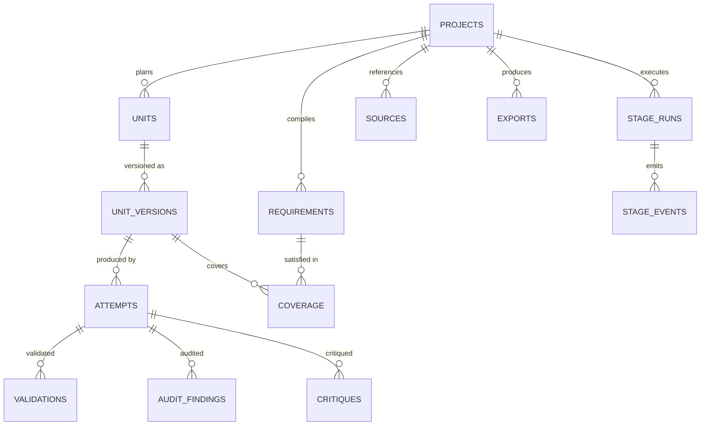
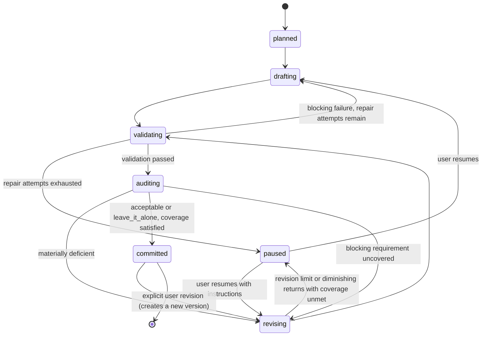

# IdeaPress — Data Model

**Database:** `ideapress.sqlite3` (or PostgreSQL), owned exclusively by IdeaPress.
**Conventions:** [Database Standards](../../standards/database-standards.md).
**Corrected 2026-08-21** by the [final architecture audit](../../reviews/final_architecture_audit.md).

---

## 1. Entity overview



---

## 2. Tables

### `projects`
```text
id ULID PK · title · slug UNIQUE · content_type · content_type_version
workflow_id · workflow_version · status                -- draft|planning|generating|paused|complete|archived
                                                       -- the pair is FK-free but resolved: `workflows`
brief_text · author_material_json · config_json        -- per-project overrides of workflow limits and bindings
created_at · updated_at · completed_at NULL · archived_at NULL
```

### `workflows`
```text
id ULID PK · workflow_id · version                       -- UNIQUE (workflow_id, version)
title · document_json · created_at
```

One **version** of one workflow definition, migration `0014`
([ADR-0143](../../adr/0143-a-workflow-is-a-stored-versioned-record-a-project-pins.md)).
`projects.workflow_id` and `projects.workflow_version` have named this table since `0001`; until
1.5 it did not exist and the two columns took any string. Append-only: a save writes the next minor
version and no row is ever updated or deleted, because a project pins the pair and a definition that
changed under a run would make a stage run's provenance a claim rather than a record.

`document_json` holds the record: `{id, version, title, stages: [{kind, prompt_id,
max_revision_rounds, model_hint}]}`, the stages in workflows §2's ordinal order. It carries the
**twelve editable kinds only** — the four gates (`validate`, `coverage`, `commit`, `export`) are
never in a workflow and a document naming one is refused at write. `standard 1.0`, which every
project created before 1.5 is bound to, is seeded by the migration and lists all twelve.

### `sources`
```text
id ULID PK · project_id FK ON DELETE CASCADE · kind      -- file|note|url
title · path TEXT NULL · sha256 · content_text TEXT NULL · metadata_json · created_at
```

The project's evidence set: what `fact_check` (workflows §2 stage 10) checks claims against, what
`export` counts for its grounding statement, and — since 1.4 — what `assemble_context` budgets as
"research notes". The `research` stage is its writer
([ADR-0116](../../adr/0116-research-runs-under-toolyard-and-fetches-only-a-named-host.md)); until
1.4 the table had readers and no writer at all. `path` carries the citation the stage's gate
demands: the URL for a `url` row, the resolved path for a `file` one. `metadata_json` carries the
`invocation_id` of the tool call that retrieved it, which is how a note joins back to its
`tool_call_records` row and to the egress decision rendered before the fetch.

### `requirements`
```text
id ULID PK · project_id FK ON DELETE CASCADE · requirement_key TEXT NOT NULL   -- "R-014"
text · blocking BOOLEAN · checks_json · source_ref
compiled_by_prompt_id · compiled_by_prompt_version · compiled_at
UNIQUE (project_id, requirement_key)
```
Requirements are compiled once and immutable thereafter; recompilation creates a new generation with
`compiled_at` and the old rows retained (a project records which generation it is working against).

### `units`
```text
id ULID PK · project_id FK ON DELETE CASCADE · unit_key TEXT NOT NULL          -- "U-03"
ordinal INT · title · goal_text · requirement_keys_json
state TEXT              -- planned|drafting|validating|auditing|revising|paused|committed
current_version_id FK NULL · paused_reason TEXT NULL · created_at · updated_at
UNIQUE (project_id, unit_key)
```

### `unit_versions`
```text
id ULID PK · unit_id FK ON DELETE CASCADE · version INT NOT NULL
content_text · content_hash · word_count · char_count
committed BOOLEAN · committed_at NULL
created_from_attempt_id FK NULL · created_at
UNIQUE (unit_id, version)
```
Committed versions are immutable. A revision creates version *n+1*.

### `stage_runs`
```text
id ULID PK · project_id FK ON DELETE CASCADE · stage TEXT NOT NULL
state TEXT              -- queued|running|completed|failed|cancelled|interrupted
units_total · units_completed · units_paused
started_at · completed_at · cancelled_at · error_code · error_text
options_json · backend TEXT · backend_mode TEXT
```
One active `stage_runs` row per project is enforced by a partial unique index (or an equivalent
repository check on SQLite).

### `attempts`
The unit of provenance: one bounded model task (or one deterministic stage step).

```text
id ULID PK · stage_run_id FK ON DELETE CASCADE · unit_id FK NULL
stage TEXT · attempt INT · round INT                    -- revision round, 0 for the first pass
transport_call INT                                      -- which physical model call within that
                                                        -- attempt (row WPF7, 0012): 0 = the call
                                                        -- whose answer the attempt kept, 1+ = a
                                                        -- call the gateway discarded and retried
                                                        -- (an empty generation). A discarded call
                                                        -- is spend, so it is a row with its own
                                                        -- tokens and debit, sharing the attempt's
                                                        -- number — the transport retry is not one
                                                        -- of `max_attempts_per_stage`
backend TEXT · backend_mode TEXT
model_provider_kind · model_provider_name · model_digest NULL · model_canonical_id NULL
prompt_id · prompt_version · prompt_sha256 · rendered_prompt_sha256
prompt_source TEXT NULL                                 -- pack | user_override (prompt standards
                                                        -- §6, 0011); NULL = no prompt rendered
prompt_text TEXT NULL · response_text TEXT NULL         -- only when content storage is enabled
response_hash · structured_output_json NULL
input_tokens NULL · output_tokens NULL · thinking_tokens NULL  -- NULL = the backend
                                                    -- reported no count at all; never 0
cache_write_tokens NULL · cache_read_tokens NULL    -- ADR-0070 rule 4's four disjoint
                                                    -- classes. NULL = the backend
                                                    -- reported no such class; 0 = its
                                                    -- protocol bills none (rule 1), and
                                                    -- only 0 may be totalled (ADR-0016)
provider_ms · overhead_ms · ttft_ms
outcome TEXT           -- completed|validation_failed|provider_error|timeout|cancelled
                       -- |content_rejected|refused    -- `refused` is a ToolYard rule declining a
                       -- research call (ADR-0116); `content_rejected` is a *model* declining a task
rejection_reason TEXT NULL                              -- the model's own words, when it refused
routing_json NULL                                       -- LoadCoach decision id, score, flags,
                                                        -- runtime_profile_hash, served_context
idempotency_key TEXT NULL                               -- sent to LoadCoach; one per attempt, so a
                                                        -- retried submission replays rather than
                                                        -- creating a second job
degradations_json · error_code · error_text · created_at
UNIQUE (stage_run_id, unit_id, stage, attempt, round, transport_call)
```

### `validations`
```text
id ULID PK · attempt_id FK ON DELETE CASCADE · check_kind · check_key
passed BOOLEAN · blocking BOOLEAN · detail_json · created_at
```

### `audit_findings`
```text
id ULID PK · attempt_id FK ON DELETE CASCADE · finding_key · category · severity
confidence NUMERIC · problem_text · evidence_text NULL · target_ref NULL
required_fix_text NULL · uncertain BOOLEAN · escalated BOOLEAN · source_stage TEXT · created_at
```

### `critiques`
```text
id ULID PK · attempt_id FK ON DELETE CASCADE
verdict TEXT           -- acceptable|leave_it_alone|materially_deficient
rationale_text · improvement_delta NUMERIC NULL · created_at
```

### `coverage`
```text
id ULID PK · unit_version_id FK ON DELETE CASCADE · requirement_id FK
satisfied BOOLEAN · satisfied_by TEXT      -- deterministic_check|audit|manual
detail_json · evaluated_at
UNIQUE (unit_version_id, requirement_id)
```

### `stage_events`
```text
id ULID PK · stage_run_id FK ON DELETE CASCADE · sequence INT NOT NULL
timestamp · event_type · unit_id NULL · message · data_json
UNIQUE (stage_run_id, sequence)
```

### `exports`
```text
id ULID PK · project_id FK ON DELETE CASCADE · format · path · sha256 · size_bytes
unit_version_ids_json · export_format_version · created_at
```

### `backend_config`, `settings`, `api_tokens`
```text
backend_config: id ULID PK · mode · base_url · model_bindings_json · last_tested_at
                · last_status · capabilities_json · is_remote BOOLEAN
settings:       key TEXT PK · value_json · updated_at
api_tokens:     as in FreeWeight
```

### `tool_call_records`
Every research tool call, whatever its outcome (1.4,
[ADR-0116](../../adr/0116-research-runs-under-toolyard-and-fetches-only-a-named-host.md), migration
`0010`, corrected by `0013`).

```text
id ULID PK · project_id FK ON DELETE CASCADE · attempt_id FK ON DELETE CASCADE
invocation_id                                           -- minted here, never by a model; how the
                                                        -- egress decision decided *before* the
                                                        -- fetch joins to the call it governed
tool_name · args_json TEXT NULL · args_sha256           -- args_json NULL under redaction; the
                                                        -- digest is always present
status TEXT            -- ok|refused|failed|timeout
reason TEXT NULL · reason_detail TEXT NULL              -- ToolYard's closed reason set, and the
                                                        -- detail that makes a refusal diagnosable
                                                        -- from the row alone (toolyard §11.2)
result_summary · result_sha256 · duration_ms
risk_class · egress                                     -- the spec's own declarations, copied so
                                                        -- the row survives a tool being withdrawn
started_at · created_at                                 -- weightsdb.UtcDateTime, like every other
                                                        -- timestamp here: naive UTC on both
                                                        -- dialects (0010 shipped these as
                                                        -- tz-aware, which only PostgreSQL
                                                        -- distinguishes; 0013 converts)
INDEX (project_id, started_at) · INDEX (attempt_id)
```

This is **not** a mounted table: ToolYard ships a record shape and one `append` method and owns no
data at all (toolyard spec §10), so unlike `ledger_*` and `egress_decisions` below there is nothing
to mount — the columns are IdeaPress's, chosen to carry every field
`toolyard.ToolCallRecord` produces without reshaping one. Refused and failed calls get rows for the
same reason the ledger records a denial: the table answers "what did this project try".

### Mounted tables (row J1): `ledger_*`, `egress_decisions`

Five tables IdeaPress does not define — `loadledger.sql.mount_ledger_tables` and
`commissioner.sql.mount_egress_tables` do, into this application's own `Base.metadata`, at module
import in `infrastructure/db/models.py` (ADR-0050). They appear in this database's own migration
history (`0007`, `0008`), are backed up and restored with everything else here, and are read and
written **only** through `loadledger.sql.SqlLedger` and `commissioner.sql.SqlEgressLedger` — never
by a query this application writes against the tables directly, and never joined to an IdeaPress
entity (ADR-0050 decision 2; a mounted shape is the owning package's to change under an upgrade
note).

```text
ledger_entries        entry_id PK · run_id · source_ref · occurred_at · unpriced BOOLEAN
                       · pricing_hash · debit_json · verdicts_json
ledger_balances        (scope, window_key) PK · tokens_spent · unpriced_debit_count
                       · untotalled_debit_count · unmetered_debit_count
ledger_balance_money   (scope, window_key, currency) PK · nanos_spent
ledger_runs            run_id PK · declared_at
egress_decisions       decision_id PK · run_id · verdict · target_name · decided_at
                       · decision_json
```

`run_id` on a ledger row is a unit's own id, or the project's pseudo-run `project:<project_id>` for
a stage attempt with no unit (`plan`, `project_review`); on an egress row it is the same value,
carried through so a decision joins to its attempt by `source_ref` (the attempt's own id) rather
than by a join to this table (workflows §8). Neither table stores a money figure: `ledger_entries`
stores usage and a `pricing_hash`, never a nanos total, and `egress_decisions` stores the whole
`governance.egress_decision` payload with four of its fields projected out as indexed columns for
the query surface (ADR-0030 rule 1, commissioner spec §10).

---

## 3. Unit state machine



`paused` is a first-class outcome, not a failure: the unit is intact, its findings are visible, and the
user decides what to do. Nothing is ever committed to escape a loop.

---

## 4. Retention and privacy

| Data | Default | Notes |
|---|---|---|
| Projects, units, versions | Forever | The user's work |
| Attempts | Forever | Provenance; prunable by age on request |
| Prompt/response text | **Not stored** unless `include_content`/per-project storage is enabled | Hashes always stored |
| Stage events | With the stage run | Pruned with the project |
| Exports | On disk in the project directory | Removed with the project on request |
| Audit findings and critiques | With the attempt | — |

Everything stays local. No project content is logged at INFO or above, transmitted anywhere, or
included in an export the user did not request.

---

## 5. Query-plan requirements

Asserted in tests:

* Unit list uses `(project_id, ordinal)`.
* Unit history uses `(unit_id, version DESC)`.
* Attempt lookup uses `(stage_run_id, unit_id, stage)`.
* Coverage report uses `(unit_version_id, requirement_id)`.
* Event replay uses `(stage_run_id, sequence)`.
* Project list uses `(status, updated_at DESC)`.
