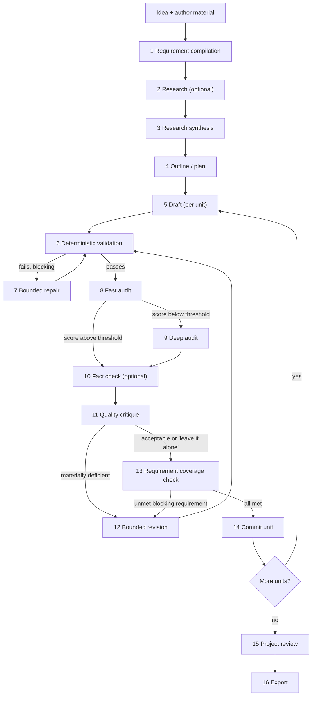

# IdeaPress — Workflows and the Inference Port

**Principle, inherited from the prior project and kept:** *Python owns the control flow; models
perform bounded tasks; the generator never approves its own output.*
**Corrected 2026-08-21** by the [final architecture audit](../../reviews/final_architecture_audit.md):
`fact_check` is a stage rather than a dangling configuration key, and the LoadCoach task map no longer
routes prose audits through a code-review profile.

---

## 1. The pipeline



Two rules make this more than a chain of prompts:

1. **Only Python decides progression.** A gate passes because a deterministic check passed or a
   bounded loop exhausted, never because a model said it was finished.
2. **Auditors report; the writer repairs.** The stage that produced text never grades it. An audit
   produces findings; a repair or revision stage consumes them.

---

## 2. Stages

| # | Stage | Input | Output | Gate | Model? |
|---|---|---|---|---|---|
| 1 | `requirements` | Brief, author material | Identified requirements (blocking/advisory), constraints, prohibitions | Every requirement has an ID and a checkable statement | Yes (bounded, JSON) |
| 2 | `research` | Brief's URLs, files in the project's `sources/` directory | Source notes with citations | Every note cites an available source | Optional |
| 3 | `research_synthesis` | Notes | Structured synthesis | Structure valid; no uncited claim | Yes |
| 4 | `outline` | Requirements + synthesis | Unit plan (ordered units with goals and requirement IDs) | Every blocking requirement assigned to ≥ 1 unit | Yes |
| 5 | `draft` | Unit spec + bounded context | Unit text | Non-empty; length band; structure | Yes |
| 6 | `validate` | Unit text | Validation report | Deterministic checks pass | **No** |
| 7 | `repair` | Text + validation failures | Revised text | Re-validated | Yes |
| 8 | `audit_fast` | Text + requirements | Findings with severity | Runs to completion | Yes |
| 9 | `audit_deep` | Text + fast findings | Detailed findings | Runs to completion | Yes (escalation only) |
| 10 | `fact_check` | Text + cited sources | Claim-level verdicts with source references | Runs to completion; every unsupported claim becomes a finding | Yes (optional; on for research-backed content types) |
| 11 | `critique` | Text + findings | Quality verdict, possibly "leave it alone" | Runs to completion | Yes |
| 12 | `revise` | Text + findings + verdict | Revised text | Re-validated and re-audited | Yes |
| 13 | `coverage` | Text + requirements | Coverage report | Every blocking requirement satisfied | **No** |
| 14 | `commit` | Validated text | Committed unit + provenance | Atomic write | **No** |
| 15 | `project_review` | All units | Consistency findings | Runs to completion | Yes |
| 16 | `export` | Committed units | Rendered document | Deterministic render | **No** |

Five stages involve no model at all: `validate`, `coverage`, `commit` and `export` — which are the
four that decide whether work proceeds — and `research`, whose "Optional" is the stage itself.
`research` reaches no model, has no `[models.stages]` binding, and the eleven bindings in
[spec §12](spec.md) are exactly the model-using stages.

**The research backend, since 1.4** ([ADR-0116](../../adr/0116-research-runs-under-toolyard-and-fetches-only-a-named-host.md)).
1.0 shipped none, and the sentence that stood here said the ADR adding one would decide its
binding. Its binding is `toolyard`: the stage builds one `ToolExecutor` per run and issues one call
per target through ToolYard's fixed registry → allowlist → schema → egress → containment order,
so every refusal is a structured result rather than an exception, and every call — refused ones
included — is a row in IdeaPress's own `tool_call_records` table. There is no prompt, no plan step
and no per-turn tool selection: Python decides the calls from what the project already holds.

* **`http_fetch`**, one call per absolute `http(s)://` URL appearing **verbatim** in the brief, in
  order, de-duplicated. Nothing rewrites, completes or infers a URL. The tool is registered only
  when `[research] allowed_hosts` names a host; on an installation that names none it is absent
  from the registry and from the allowlist, and a URL in the brief produces a recorded `REFUSED` /
  `unknown_tool` result naming the missing configuration rather than a fetch.
* **`read_file`**, one call per regular file directly inside the project's own
  `<project directory>/sources/` — the operator's drop box, and the invocation's only read root.
  An export written into the project directory sits outside that root and is refused with
  `path_escape`.

Every successful call writes one `sources` row carrying the retrieved text, its digest and its
citation — the URL or the resolved path — which is what satisfies this row's gate. A call that did
not succeed writes **no** row: a note whose source was refused cites nothing. Those rows are the
same ones `fact_check` (stage 10) checks claims against and the same ones §7 budgets as "research
notes", so a project that runs this stage changes three downstream behaviours at once and a project
that never runs it is byte-for-byte what 1.3 produced.

**Egress is decided per host, before the fetch** ([ADR-0073](../../adr/0073-egress-is-decided-on-configuration-before-availability.md),
[ADR-0103](../../adr/0103-ideapress-reacts-to-a-verdict-it-does-not-own.md)). A Commissioner verdict
is recorded for the URL's host before the executor is entered; an approved verdict raises the
invocation's egress ceiling to `network`, a denied one leaves it closed and ToolYard refuses the
call with `egress_not_permitted`. A remote host with no `[research] max_data_classification` is
denied — fail closed, the same rule the backend target follows. A denied host therefore leaves both
an `egress_decisions` row and a `tool_call_records` row, and raises nothing.

**Which stages may carry an adapter pin: exactly the model-using ones**, and only in `loadcoach`
mode. `[models.stage_adapters]` (spec §12,
[ADR-0083](../../adr/0083-an-adapter-pin-is-configured-on-by-being-configured.md)) is sparse — a
stage with no key has no pin — but a key naming a gate stage or an unknown stage is refused at
startup by the same check that refuses one in `[inference.loadcoach] job_stages`. **When a pin is
refused at run time, its stage fails**: `ADAPTER_NOT_FOUND` or `ADAPTER_PROFILE_MISMATCH`, with the
refusal on the attempt, the project untouched and the stage resumable once the configuration or the
registry changes. It is never served by the bare base — an operator who pinned a house voice and
received the base's prose has been told something false about what wrote their document.

**A project runs the stages *its own workflow* lists, which since 1.5 is a stored record rather
than this table** ([ADR-0143](../../adr/0143-a-workflow-is-a-stored-versioned-record-a-project-pins.md)).
A workflow is a versioned JSON document in IdeaPress's own `workflows` table; a project pins
`workflow_id` and `workflow_version` and keeps that version whatever is saved afterwards. What a
workflow may vary is **membership and configuration**, never order and never the gates:

* It holds only the **twelve editable kinds** — this table's sixteen minus `validate`, `coverage`,
  `commit` and `export`. Those four are §1 rule 1 itself: they always run, they are not in a record,
  and a document naming one is refused when it is written.
* Its stages are stored in this table's ordinal order; a document listing them in any other order is
  refused. `draft` before `outline` has no meaning, and the executor's shape *is* the order.
* Each stage may name a `prompt_id` from the pack (one whose required variables are identical to the
  stage's own record's), a `max_revision_rounds` on `revise`, and a `model_hint`. Absent means what
  1.4 did: the shipped record, the `workflow.max_revision_rounds` setting, the `[models.stages]`
  binding. A run's own `overrides` still win over all three.
* `draft` is required; `requirements` and `outline` go together (the plan stage runs both); `revise`
  needs `critique`; `audit_deep` needs `audit_fast`; `research_synthesis` needs `research`. Each is
  refused at write, naming the field.

The executor reads the bound definition at seven points — the plan run, any stage run, and the five
review-loop steps (`repair`, `audit_fast`, `audit_deep`, `fact_check`, `critique`/`revise`). A stage
the workflow does not list is refused **before a stage run row is written**, naming the workflow and
what it does run. `standard 1.0` — seeded by migration `0014` and what every project made before 1.5
is bound to — lists all twelve, so every one of those points takes the path this document has always
described. **A workflow without `audit_fast` can satisfy no check-less blocking requirement**: ADR-0039
makes an explicit attestation the only way, so such a requirement stays unsatisfied and its unit
pauses at the coverage gate.

This table is the **only** list of stage identifiers. `[models.stages]` keys,
`[models.stage_adapters]` keys, the LoadCoach task map in §6 and the `stage` values in the API all
draw from it, and a startup check asserts the three agree:
a binding for a stage that does not exist, or a model-using stage with no binding, fails validation
naming the stage. `fact_check` was previously bound in configuration and mapped to a task profile
while appearing in no stage list — the check exists so that cannot recur.

---

## 3. Requirement compilation

The mechanism that makes later gates checkable rather than aesthetic.

```json
{
  "requirement_id": "R-014",
  "text": "The section must state that inference runs locally and no content leaves the machine.",
  "blocking": true,
  "unit_ids": ["U-03"],
  "checks": [
    {"kind": "must_contain_any", "values": ["locally", "on-device", "on this machine"]},
    {"kind": "must_not_contain", "values": ["uploads", "sends your data"]}
  ],
  "source": "brief.md#privacy",
  "compiled_by": {"prompt_id": "stages.requirements.compile", "version": "1.0.0"}
}
```

Rules:
* Requirements are compiled **once** and carried unchanged through every stage.
* The compiler may not invent requirements the source material does not support; a test feeds it
  benign material and asserts no requirement is fabricated.
* `blocking` requirements gate the commit. Advisory ones inform critique only.
* Deterministic `checks` are what the coverage gate evaluates; a requirement with no deterministic
  check is evaluated by audit and is flagged as such in the coverage report, so the user can see which
  guarantees are mechanical and which are model-assisted.
* Audit evaluation is an **explicit attestation, never an inference from silence**
  ([ADR-0039](../../adr/0039-audit-gated-blocking-requirements.md)): the audit stages return a
  verdict (`met` / `not_met` / `cannot_judge`) for every check-less requirement, and only a literal
  `met` satisfies one — an absent verdict, `cannot_judge`, or an invented word all leave it
  unsatisfied and pause the unit. `workflow.allow_audit_gated_requirements = false` refuses even
  attestation, for a wholly mechanical gate.

---

## 4. Validation (stage 6) — no model involved

(Stage numbering follows §2; `validate` is stage 6 and is unaffected by the insertion of `fact_check`
at 10.)

| Check | Examples |
|---|---|
| Structural | Heading depth, section presence, list well-formedness, no truncated sentence, no unclosed markup |
| Length | Word/character bands per unit |
| Format | JSON validity and schema for structured units; front-matter validity |
| Content constraints | Required/forbidden phrases; language; banned meta-commentary ("as an AI…") |
| Reference integrity | Every internal reference resolves; every citation exists in the source set |
| Consistency | Names, terms and facts consistent with the project glossary and previously committed units |
| Safety | Model output contains no executable directive that would be rendered unescaped |

Failures are classed `blocking` or `advisory`. Blocking failures route to repair; three failed repair
attempts pause the unit and surface the problem to the user rather than committing something wrong.

---

## 5. Bounded loops

| Loop | Bound | Stop condition |
|---|---|---|
| Repair (after validation failure) | `max_attempts_per_stage` (3) | Validation passes, or the attempt limit, then pause the unit |
| Revision (after critique) | `max_revision_rounds` (3) | "Leave it alone", improvement below `diminishing_returns_threshold`, or the round limit |
| Audit escalation | 1 deep audit per unit per round | Fast-audit score below `audit_escalation_threshold` |

Every loop records why it stopped. **"Leave it alone" is an explicitly valid critique verdict**: a
purely stylistic preference does not trigger a revision, because endless polishing is how these
systems burn hours without improving anything.

Improvement is measured as the change in validation and audit findings between rounds — deterministic
inputs, not the critic's self-assessment.

---

## 6. The inference port

The only place workflow code meets a model.

```python
class InferenceBackend(Protocol):
    """One bounded model task. Workflow code depends on this and nothing else."""

    def health(self) -> BackendHealth: ...
    def list_models(self) -> Sequence[BackendModel]: ...
    def generate(self, request: StageRequest) -> StageResult: ...
    def stream(self, request: StageRequest) -> Iterator[StageEvent]: ...

@dataclass(frozen=True, slots=True)
class StageRequest:
    stage: StageId                      # "draft", "audit_fast", …  — IdeaPress vocabulary only
    system: str                         # rendered from a prompt record
    user: str
    response_format: ResponseFormat | None
    limits: StageLimits                 # max_output_tokens, timeout, temperature
    model_hint: str | None = None       # honoured in standalone; a hint in LoadCoach mode
    adapter_hint: str | None = None     # `[models.stage_adapters]`; LoadCoach only (ADR-0083)
    correlation: Correlation = …        # project_id, unit_id, attempt

@dataclass(frozen=True, slots=True)
class StageResult:
    text: str
    structured: Any | None
    model: ModelIdentity | None         # None when the backend does not disclose it
    usage: TokenUsage
    timing: Timing
    backend: str
    routing: Mapping[str, Any] | None   # LoadCoach only: decision id, score, flags
    adapter: AdapterSubject | None      # the adapter that ANSWERED, never the one asked for
    degradations: tuple[str, ...] = ()
```

`StageRequest.stage` uses **IdeaPress's** vocabulary. LoadCoach task IDs appear in exactly one place:

```python
# ideapress/infrastructure/backends/loadcoach.py — the ONLY module that knows LoadCoach task IDs
LOADCOACH_TASK_MAP: Final[Mapping[StageId, str]] = {
    "requirements":       "structured.extract",
    "research_synthesis": "content.research_synthesis",
    "outline":            "content.outline",
    "draft":              "content.article_draft",
    "repair":             "content.rewrite",
    "audit_fast":         "content.review",
    "audit_deep":         "content.review",
    "fact_check":         "content.fact_check",
    "critique":           "general.reasoning",
    "revise":             "content.edit",
    "project_review":     "general.reasoning",
}
```

`audit_fast` and `audit_deep` map to **`content.review`**, not `code.review`. The audit found the
earlier mapping annotated "generic review profile", which `code.review` is not: it weights measured
`code_review` capability at 0.45, applies `min_capability_scores = {code_review: 0.35}` as a hard
constraint, and declares `json_schema_ref = "schemas/code_review_findings.json"` with
`required_fields = ["findings", "summary"]`. Routing an article audit through it would have filtered
candidates on their ability to review *code* and imposed a code-review schema on prose findings — a
cross-application defect invisible from either side alone. `content.review` was added to LoadCoach's
shipped profiles for this ([Routing §2](../loadcoach/routing.md)).

The map covers every model-using stage in §2 and nothing else; a test asserts it is total over that
set, and that a `grep` for `LOADCOACH_TASK_MAP` returns one file.

### 6.1 Backends

Three implementations of the port. **"Backend" here, not "adapter"** — since 1.1 an *adapter* in
IdeaPress's configuration and on LoadCoach's wire is a LoRA (spec §11's note).

| Backend | Model selection | Notes |
|---|---|---|
| `OllamaBackend` | `[models.stages]` binding, or `model_hint` | Uses ModelRack; full control over sampling; no queue |
| `LoadCoachBackend` | LoadCoach routes by task profile | Maps `StageRequest.system`/`.user` onto LoadCoach's `system`/`prompt` fields, which LoadCoach forwards to the provider unmodified; sends a model override **only** when `[inference.loadcoach] honour_stage_bindings` is set, so the `[models.stages]` binding cannot silently bypass routing ([ADR-0040](../../adr/0040-routing-backend-owns-model-choice.md)); sends a `[models.stage_adapters]` pin as LoadCoach's `adapter` override whenever one is configured, with no gating flag, because an adapter pin does not surrender routing ([ADR-0083](../../adr/0083-an-adapter-pin-is-configured-on-by-being-configured.md)); sends `[inference] data_classification` on every request, which LoadCoach joins with the adapter's by `max()` ([ADR-0065](../../adr/0065-an-adapter-is-classified-and-local-only.md) rule 2); sets `X-Client-Name: ideapress`, `X-Request-ID` and a per-attempt `idempotency_key`; surfaces routing metadata onto the attempt; sends feedback once after commit |
| `OpenAICompatibleBackend` | Configured model per stage | Reduced capabilities, honestly reported |

Switching is a configuration change. The parity test runs the same workflow against all three and
asserts identical structure — same units, same requirement coverage, same validation outcomes — with
only wording differing.

### 6.2 Degradation

| Situation | Behaviour |
|---|---|
| LoadCoach unreachable, `fallback_mode` set, not pinned | Fall back, record the degradation on the attempt, warn in the UI |
| LoadCoach unreachable, pinned | Fail the stage with `BACKEND_UNAVAILABLE`; the project is untouched and resumable |
| LoadCoach API major mismatch | `BACKEND_VERSION_MISMATCH` naming both versions; no silent downgrade |
| Backend lacks structured output | Request text plus a parsing step, and record the degradation; never pretend a schema was enforced |
| LoadCoach enforces the task profile's schema, not the caller's | Ask for `json` rather than `json_schema` and record `structured_output_unavailable` naming the reason. A backend enforcing the *wrong* schema is further from the truth than one enforcing none — through `content.review` it would forbid `requirements_assessment` outright and make ADR-0039's attestation impossible ([ADR-0041](../../adr/0041-caller-schemas-do-not-travel-through-a-router.md)) |
| LoadCoach queue defers the stage | The attempt records `queue_wait_ms` and the UI shows the wait; interactive stages are submitted with `class = "interactive"` so a human is never behind background work |
| LoadCoach reports `assumed_context` on the decision | Recorded as a degradation on the attempt: the served context could not be established, so a context-overflow failure later is not a surprise |
| An adapter pin named an adapter LoadCoach does not have | `ADAPTER_NOT_FOUND` fails the stage, carrying the names LoadCoach *does* have. **Not** a degradation and **not** a fallback to the base: a pin that cannot be honoured is refused by name ([ADR-0064](../../adr/0064-adapters-are-selected-through-the-capability-vocabulary.md) rule 4), and it is permanent for the request as written, so it is not retried |
| An adapter pin could not be honoured under the request's profile | `ADAPTER_PROFILE_MISMATCH` fails the stage with LoadCoach's reason — an incompatible base digest, an unmeasured adapter under a gate, a classification conflict. Permanent, for the same reason, and equally never the bare base |
| The configured LoadCoach is older than 1.1 and a stage is pinned, or the declared classification is above the default | `BACKEND_VERSION_MISMATCH` naming both versions. The 1.1 fields are not silently dropped: dropping the pin would serve the base, and dropping the classification would under-declare — both are the failure the field exists to prevent |
| A model override was sent and a different model answered | Recorded as a `model_override_not_honoured` degradation naming both models. A pin is a request, not a guarantee, and LoadCoach falling back to a working model is better than a failed stage — but the user is told (ADR-0040) |
| The backend routes internally (`routes_internally`) | IdeaPress resolves no `[models.stages]` binding, requires none, and performs no unload: model choice and residency belong to the backend that owns them (ADR-0040, [ADR-0038 §1](../../adr/0038-one-model-at-a-time-per-gpu.md)) |
| The model returned **no text at all** after exhausting its output budget | One transport retry, in Python, at the gateway, **with the model's reasoning suppressed** where the backend can carry that (`think: false` on Ollama; recorded as a degradation, so a reader knows the answer came without reasoning). A second *identical* request spends the budget the same way — WP6 measured that at 8 192 tokens and row WPF7 measured it again at 16 384, 375 seconds a call — so the retry has to differ, and Python is what differs it — the provider returned an empty body, so there is nothing to validate and nothing a model decided. The discarded call is an attempt row of its own (`transport_call` 1) with its tokens and its debit: it is spend, and a run that cannot say what it spent is the gap WP6 found. A second empty answer fails with `CONTEXT_LIMIT_EXCEEDED` naming the budget, and it too is recorded (`transport_call` 2) |
| A cancel arrives while a model call is in flight | Honoured at the **next model-call boundary**, and every model call is a boundary — the transport retry included, which no stage body can see. The gateway checks the run's cancel flag immediately before each call, so a cancel during an empty generation makes no second call and the run ends `cancelled`, not `failed` (row WPF7) |
| A stage's budgets exceed what the backend serves | **Refused before the run** (row WPF7), naming the stage, its context budget, its output budget, the prompt overhead and the served context. A prompt, the model's reasoning and its answer come out of one window: a stage that cannot fit returns no text at all rather than a short answer, so it is never started. `inference.ollama.served_context_tokens = 0` turns the check off — the server's own default cannot be read from here, and a check with no figure is a guess |
| Context overflow | Reduce bounded context (documented reduction order), then fail with numbers |
| Next stage's binding names a different model from the resident one | Unload the resident model, then load the incoming one — never both at once ([ADR-0038](../../adr/0038-one-model-at-a-time-per-gpu.md)). The unload and the reload are recorded on the attempt as a `model_switch` degradation with their durations, because on a single-GPU machine a switch costs a full reload and the user is entitled to see what the two-model default is costing them |
| Preflight finds less free VRAM than the model needs with room for its context | `INSUFFICIENT_VRAM` naming both figures; the stage is not started and the project is untouched and resumable. Only when `ideapress[telemetry]` is installed — without it the invariant holds by serialising and unloading, and no preflight runs |

---

## 7. Context assembly

Model context is assembled by Python, deterministically and within a budget:

```text
system prompt (record)                                   fixed
unit specification + its requirements                    always
project glossary + style constraints                     always
neighbouring committed units (summaries first)           budgeted
relevant research notes                                  budgeted, ranked by explicit reference
previous attempt's findings (repair/revision only)       always
```

Reduction order when the budget is exceeded: research notes → distant unit summaries → adjacent unit
summaries. Requirements and the unit specification are **never** dropped; if they alone exceed the
budget, the stage fails with numbers rather than silently truncating the contract.

Since J2 ([ADR-0104](../../adr/0104-an-adopted-reductions-seam-and-error-vocabulary-survive-it.md)),
this order is enforced by `cutctx`'s `DropOldestPolicy` behind `domain.context_assembly`'s unchanged
`assemble_context()` seam, rather than by a hand-rolled fill loop; the order above, and everything
else on this page, is unchanged by the adoption.

**"Relevant research notes" became reachable at 1.4.** Until then `assemble_context` accepted
`research_notes`, ranked them and dropped them first, and no running stage ever passed one — the
first line of the reduction order was exercised only by tests. §2's `research` stage is the
supplier: the `sources` rows it writes are what the draft and repair path passes as
`(title, text)` pairs, ranked by explicit reference exactly as this section says. The revision path
deliberately still passes none — `stages.revise.improve` asks for the smallest possible change, and
broader context invites the opposite — so a revision's context is the narrow one it has always been.

`project_review` (stage 15) assembles a different context — every committed unit, and nothing else
— through the same `DropOldestPolicy` chain behind a sibling seam,
`domain.context_assembly.assemble_review_context()` (row K3). Nothing there is pinned: stage 15's
only documented input is every committed unit, so the reduction order is units dropped from the
*end* of reading order first — the earliest units establish the terms and facts later ones are
checked against, so keeping that end intact for as long as the configured budget allows
(`workflow.project_review_context_budget_tokens`) gives the reviewer an actual anchor, where
dropping from the front would leave it comparing later units to each other with none. Because
nothing is pinned, CutCtx's own overflow error cannot apply here; a budget too small to hold even
the single cheapest unit is refused explicitly instead of silently reviewing an emptied document.

---

## 8. Commit and provenance

A commit is atomic and records, per unit:

```text
unit_id · version · content_hash · committed_at
workflow_id + version · content_type + version
stage attempts (each: stage, attempt, transport_call, backend, model identity, adapter subject,
                prompt_id + version + hash, usage, timing, outcome, degradations)
validation report · audit findings · critique verdict · revision rounds and stop reason
requirement coverage (per requirement: satisfied, by which check, by which stage)
routing metadata when the backend supplied it — decision id, score, flags, the selected model's
                 canonical id, its runtime profile hash and its served context
```

The **adapter subject** is the adapter's name, its artifact digest and the canonical subject string
`provider/name@sha256:…+adapter@sha256:…`, taken from what LoadCoach's response said answered the
request — never from the pin that asked for it. What was requested and what answered are different
facts and a pin can be refused between them, so recording the request would make the provenance
record say something nobody verified. `NULL` in all three columns means no adapter answered, which
is distinct from an adapter whose name is empty (impossible) and is why the columns are nullable
rather than defaulted to `""`.

**Row J1 adds two more facts to the same funnel** (`services/stages.py::record_attempt`), recorded
once per attempt, atomically with the attempt row: a **budget debit** (LoadLedger) and an **egress
decision** (Commissioner). Neither changes what is recorded above; both ride beside it.

* **The debit.** `run_id` is the unit's own id, or — for a stage attempt with no unit (`plan`,
  `project_review`) — the project's pseudo-run `project:<project_id>`, so nothing is silently
  undebited. Tags are `project:<id>`, `stage:<name>` and `backend:<name>`. Usage and a
  `pricing_hash` are stored; money is never stored, only re-derived (ADR-0030). A local model's
  cost is `UNSUPPORTED`, rendered `—` with the reason, never `$0.00` (ADR-0016); a price list that
  could not total an estimate renders "at least" (ADR-0069). A bound `per_output` ceiling pauses
  the unit exactly as an exhausted output-token budget already does (ADR-0103); a bound
  `per_project` ceiling (lifetime, never resets) is visible on the workspace's project-cost badge
  and pauses nothing directly.
* **The decision.** Evaluated against the backend as *configured* — its remote-ness, its declared
  `max_data_classification` — never against whether it currently answers (ADR-0073's ordering,
  applied here even though IdeaPress has one configured backend rather than PromptCadence's several
  tiers). A local backend (Ollama) is always `target_not_remote`; a remote backend with no declared
  ceiling is denied, fail closed (ADR-0054, ADR-0103). Commissioner does not enforce: IdeaPress's
  own `providers.allow_remote` gate at startup is what actually refuses a call, unchanged by this
  row. The decision's `source_ref` is the attempt's own id, so a denial is visible beside the
  attempt it was evaluated for (§8's provenance table) without a join to the mounted table
  (ADR-0050 decision 2).

Both are best-effort relative to the attempt itself: a governance failure (a misconfigured currency,
say) is logged and never blocks recording the attempt — provenance is the funnel's first duty.

Committed units are immutable; a revision creates a new version and the history is retained.

---

## 9. Failure and resumption

* A failed stage pauses that unit; other units are unaffected.
* Committed units are never rolled back by a later failure.
* `ideapress stage run --resume` continues from the first incomplete unit.
* Process death mid-stage: the attempt is marked `interrupted` at startup; the unit is resumable; no
  partial content is ever committed.
* Cancellation is honoured at the next model-call boundary; partial output is preserved on the attempt
  record but never committed.

---

## 10. Content types

A content type supplies the unit taxonomy, the validators specific to its structure, its default
workflow and its export templates. Shipped at 1.0: **article** and **report**. The registry is open
(`ContentType` protocol, auto-discovered from an entry-point group), and the engine knows only units
and requirements — never chapters, sections or quests.

---

## 11. What a model is never allowed to do

* Decide that a stage is complete.
* Decide that a requirement is satisfied **by saying nothing about it**. Where a deterministic
  check exists the check decides and no verdict can overturn it; where none exists, only an
  explicit, labelled `met` attestation satisfies it, and silence, `cannot_judge` or an invented
  word all leave it unsatisfied ([ADR-0039](../../adr/0039-audit-gated-blocking-requirements.md),
  §3 above). `workflow.allow_audit_gated_requirements = false` removes even that.
* Modify requirements, the plan, or committed units.
* Choose which unit to work on next.
* Cause code execution, a filesystem path, a network call or a database query.
* Set its own retry or revision budget.
