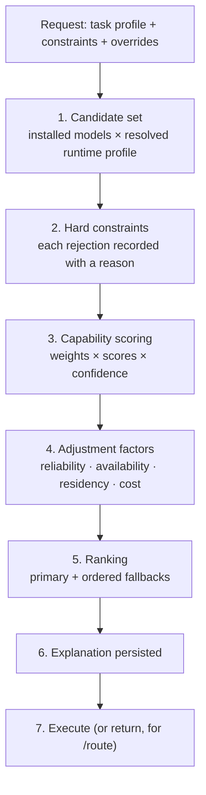

# LoadCoach — Routing and Explainability

**Owner:** LoadCoach. **Evidence policy:** [ADR-0017](../../adr/0017-benchmark-confidence-and-freshness.md).
**Rule:** every decision is explainable, and the explanation is persisted for every job — not sampled.
**Also normative:** [ADR-0023](../../adr/0023-runtime-profile-resolution.md) (execution subject and served context), [ADR-0027](../../adr/0027-multi-gpu-semantics.md) (per-device admission).
**Also normative from 1.1:** [ADR-0055](../../adr/0055-loadcoach-registers-providers-by-name-and-kind.md) (providers by name and kind), [ADR-0058](../../adr/0058-the-execution-subject-gains-an-adapter-axis.md) (the subject's adapter axis), [ADR-0064](../../adr/0064-adapters-are-selected-through-the-capability-vocabulary.md) (selection rides the vocabulary), [ADR-0066](../../adr/0066-residency-is-two-level.md) (two-level residency), [ADR-0067](../../adr/0067-reliability-keys-on-the-subject-not-the-base.md) (reliability keys on the subject).

---

## 1. The pipeline



Steps 1–6 run for `POST /route` as well as for execution, so a caller can see the decision without
spending a GPU second.

---

## 2. Task profiles

A task profile is the routing intent, not a prompt.

```toml
[task_profiles."code.review"]
version = "1.2.0"
description = "Review a diff or file for defects, prioritising precision over recall."

[task_profiles."code.review".weights]         # must sum to 1.0 (validated)
code_review           = 0.45
reasoning             = 0.20
instruction_following = 0.15
structured_output     = 0.10
long_context          = 0.10

[task_profiles."code.review".constraints]
min_context_tokens        = 16384
requires_capabilities     = ["structured_output"]
max_latency_p95_seconds   = 120
min_capability_scores     = { code_review = 0.35 }
exclude_models            = []
allow_remote_providers    = false
allow_cpu_spill           = false                     # ADR-0149: true raises a configured context

[task_profiles."code.review".execution]
temperature       = 0.1
max_output_tokens = 4096
response_format   = "json_schema"
json_schema_ref   = "schemas/code_review_findings.json"
max_attempts      = 3
fallback_depth    = 2
think             = false                     # optional; unset, true or false

[task_profiles."code.review".validation]
require_valid_json = true
require_schema     = true
required_fields    = ["findings", "summary"]
max_output_chars   = 200000
```

Rules: profiles are versioned; every job records the version it used; weights are validated to sum to
1.0; constraints are hard (they filter) while weights are soft (they rank); a profile may not
reference a capability outside the SetSpec vocabulary.

`execution.think` is the one execution parameter that changes which candidates are *eligible*
([ADR-0099](../../adr/0099-a-task-profile-may-ask-for-reduced-thinking.md)). It has three states:
**unset** sends no control and builds the request a profile without the field built before 1.1.1;
**`false`** asks the provider to suppress reasoning; **`true`** asks for it. A profile that sets it
either way **requires `thinking_control` of every candidate**, so a candidate whose provider cannot
carry the control is rejected by `capability_unsupported` with
`details.capability = "thinking_control"` and `details.required_by = "task_profile"` —
`"request"` where `sampling.think` imposed it instead. The requirement is enforced at routing, in
ADR-0075's loop, rather than at the provider edge, because a `CapabilityUnsupported` raised after a
model has been chosen fails a job that routing could have answered with a reason. `thinking_control`
is a **provider** capability and is deliberately *not* spellable in `requires_capabilities`, which
is validated against the SetSpec vocabulary; the vocabulary's neighbouring model flag is `thinking`
and it means something else. The lever exists because the output budget is not one: gpt-oss:20b
under `response_format = "json"` answered nothing 1 time in 6 at 4 096 output tokens and 3 in 6 at
8 192, spending the whole budget reasoning (G2 gate E, and again on an agent turn at I2 §10).

**Which installed models honour it, measured** (I6, 2026-09-07; Ollama `0.32.13` on the reference
machine). All ten models installed there, two streamed `POST /api/chat` requests each — `think:
true` then `think: false` — over **one** prompt for every model: PromptCadence's `planner.draft`
1.1.0 rendered in I3 gate D's shape (287-character system turn, 1 976-character user turn) under
`tools.plan`'s execution block, `format: "json"`, `temperature = 0.1`, `num_predict = 4096`. The
digests, the raw run log and the exact request bodies are in
[`history/handoffs/I6_HANDOFF.md`](../../history/handoffs/I6_HANDOFF.md) §4; nothing here judges answer quality.

| Model (Ollama tag) | `think: true` | `think: false` |
|---|---|---|
| `gpt-oss:20b` | `thinking` 2 424 chars, `content` empty, `done_reason=stop` | **Ignores it.** No `thinking` key at all; the reasoning arrives as `content` ("We need to produce a plan…"), so `require_valid_json` fails — and the stream then ends with no terminal chunk (see below) |
| `qwen3.5:9b-q8_0` | `thinking` 15 988 chars, `content` empty, `done_reason=length` — the whole 4 096 budget | Honours it. No `thinking`; 1 106 chars of valid JSON, `stop` |
| `sorc/qwen3.5-heretic:9b` | `thinking` 15 036 chars, `content` empty, `length` | Honours it. 1 345 chars of valid JSON, `stop` |
| `SetneufPT/Qwen3.5-9B-Coder_Q4_256k_ABL_16GB-GPU:latest` | `thinking` 13 617 chars, `content` empty, `length` | Honours it. 778 chars of valid JSON, `stop` |
| `fredrezones55/Qwen3.6-35B-A3B-Uncensored-HauhauCS-Aggressive:IQ2_M` | `thinking` 14 941 chars, `content` empty, `length` | Honours it. 1 104 chars of valid JSON, `stop` |
| `gemma4:12b-it-q8_0` | `thinking` 12 250 chars, `content` empty, `length` | Honours it. 1 026 chars of valid JSON, `stop` |
| `ornith:9b` | `thinking` 288 chars **and** 721 chars of valid JSON, `stop` | Honours it. 251 chars of valid JSON, `stop` |
| `hk:latest` | `thinking` 2 713 chars **and** 611 chars of valid JSON, `stop` | Honours it. 243 chars of valid JSON, `stop` |
| `HammerAI/gemma-4-e4b-heretic:e4b-q8_0` | `thinking` 1 902 chars **and** 817 chars of valid JSON, `stop` | Honours it. 243 chars of valid JSON, `stop` |
| `deepseek-coder-v2:latest` | Refused: HTTP 400, `"deepseek-coder-v2:latest" does not support thinking` | **Crashes the Ollama server** (3 of 3, with and without `format: "json"`); systemd restarts it |

Three facts an operator should carry out of that table. **Eight of the ten honour the control**, and
on those eight `think = false` is the difference between spending the whole output budget on
reasoning and answering in a second — six of the eight returned `done_reason=length` with an empty
`content` under `think: true`, which is the failure mode the lever exists for. **`gpt-oss:20b` does
not honour it**: it relocates its reasoning into `content`, which fails `require_valid_json`, and
under `format: "json"` its stream then dies — **12 of 13** requests straight to Ollama and 1 of
3 through ModelRack, with `ProviderProtocolError: The stream from … ended without a terminal chunk` (I6 gate
C: Ollama closes the stream, `OllamaProvider` reports it honestly, and LoadCoach classifies it
`protocol_error` and retries the same candidate before falling back). It is the pair that fails —
`think: false` **and** `format: "json"`; `think: false` alone completed 3 of 3. **`think = false` is
not free of risk on a model that does not carry the control**: `deepseek-coder-v2:latest` rejects
`think: true` with a clean 400 and takes the whole Ollama process down on `think: false`, so a
profile that sets the field is only as safe as the candidates routing can reach.

Shipped profiles: `general.chat`, `general.reasoning`, `general.summarize`, `code.generate`,
`code.review`, `code.debug`, `content.research_synthesis`, `content.outline`,
`content.article_draft`, `content.rewrite`, `content.edit`, `content.review`,
`content.fact_check`, `structured.extract`, `tools.agent`, `tools.agent.local_fast`,
`tools.agent.local_large`, `tools.agent.remote_cheap`, `tools.agent.remote_frontier`,
`tools.plan`, `adapters.measured` — twenty-one.

`adapters.measured` is the profile that scores **imported adapter evidence**. Its weights are the
A-2 regression panel's two fixed suites, which FreeWeight measures on every adapter subject it
measures at all, so it finds a measurement whatever an adapter was trained for. It sets **no**
`min_context_tokens`, deliberately: a minimum makes LoadCoach configure a served context, which
enters `runtime_profile_hash`, and evidence measured under a different profile is excluded by name
([ADR-0023](../../adr/0023-runtime-profile-resolution.md)). A deployment that pins a context here
must pin the same one in FreeWeight's `[runtime]`.

The five before it are **PromptCadence's harness profiles**, namespaced specializations of `tools.agent`
shipped as LoadCoach configuration rather than PromptCadence code
([ADR-0047 §1](../../adr/0047-a-tier-is-configuration-and-a-model-never-sizes-its-own-budget.md)).
A PromptCadence tier is a name over exactly one of them, so the four `tools.agent.*` profiles carry
the tier distinctions LoadCoach can express — a latency ceiling, a minimum served context equal to
the tier's `context_budget_tokens`, minimum capability scores and `allow_remote_providers` — and
nothing about model size, which LoadCoach has no vocabulary for. `tools.plan` is the planner's
intent: JSON out, validated as JSON, with **no** schema, because the plan document's shape stays
PromptCadence-internal. The two remote profiles ship with `allow_remote_providers = true` and route
to `NO_ELIGIBLE_MODEL` until a remote provider is registered; PromptCadence reports that as
`TIER_UNAVAILABLE`, which is visible rather than silent.

`content.review` reviews **prose** against a requirement set and returns structured findings. It is
weighted on `auditing`, `instruction_following`, `reasoning` and `structured_output`, and it exists
because reviewing writing and reviewing code are different routing intents that would otherwise be
served by one profile: `code.review` filters candidates on measured `code_review` capability and
imposes a code-review JSON schema, neither of which describes an audit of an article.

**A task profile never carries a prompt.** It carries intent, constraints, execution parameters and a
validation policy. A caller's prompt is passed to the provider unmodified
([Spec §9](spec.md)); the only prompt records LoadCoach applies are the ones it originates — the
structured-output corrective retry and the circuit-breaker re-probe — and each is recorded on the
attempt that used it.

---

## 3. Step 1 — Candidate set

Every model the registry knows, that the configured providers can currently serve. Models never seen
by discovery are not candidates. A model explicitly named in the request bypasses scoring but **not**
hard constraints (an override that would fail is refused with the reason, not silently honoured).

A candidate is not a model but an **execution subject**: from 1.1 the triple `(identity,
adapter | none, resolved runtime profile)` ([ADR-0058](../../adr/0058-the-execution-subject-gains-an-adapter-axis.md)).
The profile resolves before scoring, through
`[runtime].default → [runtime.models."<canonical_id>"] → task-profile runtime settings →
overrides.runtime_profile`, and its hash is what evidence must match
([ADR-0023](../../adr/0023-runtime-profile-resolution.md)). `RuntimeProfile()` — every field unset,
meaning "provider defaults" — is a legal profile with a stable hash; there is no unprofiled
execution.

From the resolved profile and the provider's capabilities, one further value is derived and recorded
on every candidate, because every context decision below depends on it:

```text
served_context = runtime_profile.context_size     when set               → source "configured"
                 provider-reported served context when exposed           → source "reported"
                 descriptor.max_context           otherwise, flagged     → source "assumed"
```

Where `ProviderCapabilities.context_configurable` is true and the task profile declares
`min_context_tokens`, LoadCoach **sets** `context_size` rather than hoping — so the common case is
`configured`, not `assumed`.

### 3.1 Provider registrations and the pool they feed

Every registered provider ([ADR-0055](../../adr/0055-loadcoach-registers-providers-by-name-and-kind.md),
[ADR-0077](../../adr/0077-a-named-provider-block-and-the-singular-block-are-one-registry.md)) is
discovered into **one** registry, and every model carries the name of the registration that serves
it, that registration's kind, and its declared egress class. Filtering, scoring, ranking, residency
and reliability are unchanged code over a larger pool.

`is_remote` is read from the registration's declared `remote` flag, never inferred from a kind or a
URL: an OpenAI-compatible endpoint on loopback is local, and the same kind pointed at a hosted API
is remote. The same weights served by two registrations are **two subjects**, with separate
evidence and separate statistics, because `provider_kind` is part of model identity
([ADR-0008](../../adr/0008-canonical-model-identity.md)) and two measurements of them are not
interchangeable.

### 3.2 Adapter subjects

Where a registration's provider declares `adapter_hot_swap` and an adapter's manifest is compatible
with a base that provider serves, the candidate list gains one subject per `(base, adapter)` pair
**beside** the bare base — never instead of it. Expansion happens only under those two conditions:
a provider that cannot hot-swap contributes no adapter subjects at all
([ADR-0062](../../adr/0062-llamacpp-serves-adapters-through-a-supervised-process.md) decision 5),
and an adapter whose declared base digest does not match the served base is refused rather than
tried ([ADR-0058](../../adr/0058-the-execution-subject-gains-an-adapter-axis.md) §5).

An adapter whose manifest declares its base **by name only** may still be used, and its subject
carries `IdentityConfidence.NAME_ONLY` through the existing machinery — displayed, stored and
discounted like any other name-only identity, not flagged by a parallel mechanism.

The runtime profile a candidate resolves against records **whether the serving process has adapters
registered at all**: `adapters_registered` is `True` for a registration holding registrations,
`False` for one holding none, and never `None`
([ADR-0074](../../adr/0074-adapter-enabled-serving-is-a-runtime-profile-field.md)). It is derived
from what LoadCoach handed the provider, not from a `list_adapters()` snapshot, which moves while a
restart is pending. A profile that disagrees with the server ModelRack would use is that package's
refusal, and LoadCoach's job is never to earn it.

## 4. Step 2 — Hard constraints

Applied in this order; the first failure records the rejection and stops evaluating that candidate.

| Constraint | Rejection reason | Source |
|---|---|---|
| An operator disabled the model | `model_disabled` | Registry ([ADR-0118](../../adr/0118-a-discovered-model-can-be-disabled.md)) |
| The resolved profile asks an Ollama registration for `flash_attention` or `kv_cache_precision`, which it reads daemon-wide | `runtime_setting_unhonoured` | Resolved profile + provider kind ([ADR-0120](../../adr/0120-kv-cache-precision-and-flash-attention-are-per-model-llamacpp-settings.md) rule 4) |
| The resolved profile asks for a `q8_0`/`q4_0` KV cache without flash attention | `kv_cache_needs_flash_attention` | Resolved profile ([ADR-0120](../../adr/0120-kv-cache-precision-and-flash-attention-are-per-model-llamacpp-settings.md) rule 3) |
| Model not available from any healthy provider | `model_unavailable` | Registry + provider health |
| **Served** context < `min_context_tokens` | `context_too_small` | Resolved profile + provider |
| Task profile needs a context the provider will not be asked to serve | `context_not_configurable` | `ProviderCapabilities.context_configurable` |
| Estimated context need > served context | `context_limit_exceeded` | Request + resolved profile |
| Missing a required capability (tools, structured output, vision) | `capability_unsupported` | Provider + declared capabilities, and the request itself ([ADR-0075](../../adr/0075-a-request-carrying-tools-requires-tool-use-of-every-candidate.md)) |
| A set `think` the provider cannot carry | `capability_unsupported`, `details.capability = "thinking_control"` | `ProviderCapabilities.thinking_control`, required by the profile's `execution.think` or the request's `sampling.think` ([ADR-0099](../../adr/0099-a-task-profile-may-ask-for-reduced-thinking.md)) |
| Estimated VRAM need > free VRAM + headroom on **every** device | `insufficient_vram` | SweatMeter + estimate, evaluated per GPU ([ADR-0027](../../adr/0027-multi-gpu-semantics.md)) |
| Estimated RAM need > free RAM | `insufficient_ram` | SweatMeter |
| Capability score below `min_capability_scores` | `below_minimum_score` | Evidence |
| Model in `exclude_models`, or provider is remote while remote is disallowed | `excluded_by_policy` | Profile + config |
| Adapter's declared base digest does not match the served base, or its provider cannot hot-swap | `adapter_incompatible` | Manifest + provider |
| Adapter subject with no measured evidence for the profile's top-weighted capability, while `require_adapter_evidence` is on | `adapter_unmeasured` | Evidence + config |
| Adapter's classification forbids the egress this candidate would be | `adapter_classification_conflict` | Manifest + registration |
| Circuit breaker open for this **subject** | `recently_failing` | Reliability stats |

A required capability comes from one of two places, and the rejection says which: the task
profile's `requires_capabilities`, or the request itself — a `POST /generate` body carrying a
non-empty `tools` requires `tool_use` of every candidate for that request alone
([ADR-0075](../../adr/0075-a-request-carrying-tools-requires-tool-use-of-every-candidate.md)). The
two are unioned, never traded off, and `capability_unsupported`'s detail carries
`required_by = "task_profile" | "request"` so a caller can tell a profile it chose from an offer it
made. A request-level capability filters; it never scores.

Every rejection is stored with the numbers that caused it (`needs 14.2 GB, 9.8 GB free on GPU 0,
7.1 GB free on GPU 1`), because "nothing was eligible" is useless without them. Advertised context is
never a constraint input; a model that advertises 131 072 tokens and will be served 4 096 is rejected
by `context_too_small`, not admitted and silently truncated.

The three adapter constraints, in the words a caller needs:

* **`adapter_incompatible`** — the adapter cannot be applied to this base at all. Its detail carries
  the manifest's declared base name and digest and the served base's digest, or the fact that the
  provider declares no `adapter_hot_swap`. There is no configuration that makes this candidate
  eligible; the remedy is a different adapter or a different base
  ([ADR-0058](../../adr/0058-the-execution-subject-gains-an-adapter-axis.md) §5).
* **`adapter_unmeasured`** — `[routing] require_adapter_evidence` is on (the default,
  [ADR-0064](../../adr/0064-adapters-are-selected-through-the-capability-vocabulary.md) rule 3) and
  this adapter subject has no measured evidence for the profile's top-weighted capability. **The
  gate reads the *resolved* capability score, not the raw signals**
  ([ADR-0087](../../adr/0087-the-evidence-gate-admits-only-a-signal-that-scores.md)): a benchmark
  that scoring then excludes — unbound, foreign machine, mismatched runtime profile (§5) — does not
  satisfy it, and neither does a `declared` flag, a `manual` score or a band prior. One breakdown
  answers both questions, so the gate and the scorer cannot disagree about what counts as measured.
  Its detail names which kind of unmeasured this is: `resolved_source`, the note, both profile
  hashes or the foreign machine's fingerprint, and the `freeweight run start …` remedy — because
  "nobody has benchmarked this" and "the benchmark does not describe this execution" have different
  remedies. **Move a runtime profile field and an adapter measured under the old one becomes
  unroutable by name** until it is re-measured; it does not degrade to a declared claim and keep
  routing. **An
  adapter subject inherits nothing from its base** ([ADR-0081](../../adr/0081-an-adapter-subject-inherits-no-evidence-from-its-base.md)):
  its only signals are the vocabulary terms its own manifest declares, so with the gate off it
  scores on declarations and priors and usually ranks below a base carrying real evidence — a pin
  is how an adapter is used until FreeWeight measures one. **Until
  FreeWeight measures adapters (LA3), every adapter subject is unmeasured**, so the shipped default
  makes adapters invisible to *routed* selection while leaving pins working. That is the intended
  behaviour of "no benchmark, no use", not a defect: turning the gate off is an operator's
  configuration change, it is recorded on every decision made under it, and the resulting selection
  carries the existing `low_evidence` flag.
* **`adapter_classification_conflict`** — the adapter's `data_classification` forbids the egress
  this candidate would be ([ADR-0065](../../adr/0065-an-adapter-is-classified-and-local-only.md),
  [ADR-0079](../../adr/0079-an-adapter-classification-refusal-is-a-routing-rejection.md)). Its
  detail names the adapter's classification, the caller's declared classification where one was
  supplied, the effective `max()` of the two, and the provider name and `remote` flag that made the
  candidate an egress. It is deliberately **not** `excluded_by_policy`: that rejection is fixed by
  turning remote on, and this one cannot be fixed by any flag. This rejection row **is** the
  recorded denial integration verification I19 asks for; a `governance.egress_decision` is written
  only by an application holding a Commissioner ledger, about a request it meant to send.

`kind = "fake"` declares a small model by default so a fake-provider journey never trips
`insufficient_vram` on its own (E6, `docs/history/handoffs/E6_HANDOFF.md`); `[provider.fake]`'s `size_bytes`, `layers`,
`kv_heads` and `head_dim` — set all four together, never a subset, since the KV term dominates
`size_bytes` at any interesting context length — let an operator provoke this rejection on purpose
and inspect the full `estimate` block it produces.

## 5. Step 3 — Capability scoring

```text
capability_score(model, capability) =
    evidence_score          when measured evidence exists
    declared_score          when only a declared capability exists   (see §5.1)
    absent                  otherwise   (contributes nothing; never 0)

task_fit(model) = Σ_c ( weight_c × score_c × confidence_c )
                  ─────────────────────────────────────────
                          Σ_c ( weight_c × present_c )
```

* Evidence contributes to a candidate **only when its `runtime_profile_hash` equals the candidate's
  resolved hash**, and its `machine_fingerprint` rules follow
  [ADR-0017](../../adr/0017-benchmark-confidence-and-freshness.md). Evidence for the same model under
  a different profile is neither reused nor scored zero: it is named in the explanation as
  `evidence_profile_mismatch` with both hashes and the FreeWeight invocation that would produce
  matching evidence, and it counts toward `low_evidence` like any other absence.
* **An excluded measurement scores the prior it displaced**
  ([ADR-0088](../../adr/0088-an-excluded-measurement-falls-back-to-the-prior-it-displaced.md)): the
  parameter band prior's score at its fixed low confidence, under the exclusion's own source, note
  and remedy — so the explanation is unchanged and a subject somebody benchmarked no longer ranks
  *below* one nobody has ever measured. Where there is no band prior, or a profile refuses priors,
  it is absent, exactly as the unmeasured sibling would be. The resolved source is never a measured
  source, so `low_evidence`, `measured_weight` and the evidence gate above are all unaffected: it
  scores like a prior, and it is not called one.
* Evidence whose `match_state` is not `bound` — imported for a model discovery has not seen, or
  `name_only` against a local row that carries a digest — never contributes
  ([ADR-0022 §4](../../adr/0022-capability-evidence-record-contract.md)).
* `confidence_c` comes from FreeWeight's evidence
  ([ADR-0017](../../adr/0017-benchmark-confidence-and-freshness.md)). LoadCoach applies it; it never
  recomputes it. Its freshness derives from `measured_at`, so a producer that re-aggregates old runs
  does not present them as new.
* A capability with no evidence is **excluded from both numerator and denominator** and named in the
  explanation. Absence of evidence is not evidence of incapacity.
* When a profile's *total present weight* falls below a configured floor (default 0.5), the decision
  is flagged `low_evidence` and surfaced in the UI and API.

### 5.1 Declared-capability fallback (no FreeWeight)

With no measured evidence, LoadCoach uses a conservative prior derived from what is known without
measuring:

| Signal | Contribution |
|---|---|
| Provider-declared capability flags (tools, structured output, vision, thinking) | Gates hard constraints; contributes 0.5 as a neutral prior to the matching capability |
| Parameter count band (relative to other installed models) | Small prior toward general capability, capped |
| User-configured manual scores (`[manual_capabilities]` in configuration) | Used directly, marked `source: manual` |
| Production evidence from executed jobs | **Never a capability score** (§11, [ADR-0037](../../adr/0037-production-evidence-never-raises-capability-scores.md)). Acts only through the `reliability_factor` (§6, bounded 0.5–1.0) once the minimum sample count is reached: it can lower a model that fails in production, never raise one that succeeds |

Every such score is marked with its source and a fixed low confidence (default 0.3), so a single real
benchmark result outweighs any prior. Routing without FreeWeight is therefore *reasonable*, clearly
labelled, and **guarded rather than self-improving**: production evidence disciplines a failing
model through the reliability factor, the breaker and regression detection, while upward adaptation
from production success is deliberately deferred to post-1.0 exploration routing (spec §21,
ADR-0037). Scores improve when measurement arrives — a FreeWeight import, or a manual score.

## 6. Step 4 — Adjustment factors

```text
final_score = task_fit
            × reliability_factor
            × availability_factor
            × residency_factor
            × cost_factor
```

| Factor | Range | Definition |
|---|---|---|
| `reliability_factor` | 0.5–1.0 | From production evidence: validation pass rate, error rate, timeout rate for this task profile. Neutral (1.0) until the minimum sample count |
| `availability_factor` | 0.7–1.0 | Estimated queue-and-load cost: currently executing on this model, expected wait |
| `residency_factor` | 0.90–1.05 | Two-level (§6.1, [ADR-0066](../../adr/0066-residency-is-two-level.md)): a small bonus for a candidate on the resident base, whatever adapter it names, and a configurable penalty for one that would need a different base loaded |
| `cost_factor` | 0.0–1.0 | 1.0 for local providers; configurable penalty for remote ones. Also enforces `allow_remote` as a hard constraint upstream |

Each factor's value and inputs are recorded. The residency bonus is deliberately small: it breaks
ties, it does not override capability.

### 6.1 Two-level residency

Residency is the pair `(resident base process, registered adapter set)`, and the two levels are
scored differently, because the expensive event is loading a base and not selecting an adapter:

```text
residency_factor = 1 + prefer_resident_bonus     candidate's base is the resident base
                                                 (any registered adapter, including none)
                 = 1                             nothing is resident, or residency is unknown
                 = 1 - base_switch_penalty       a different base is resident and this candidate
                                                 would require loading its own
```

`prefer_resident_bonus` keeps its shipped default of `0.05`. `base_switch_penalty` defaults to
`0.10` — **chosen, not measured**: twice the residency bonus, so a base switch is never decided by
the tie-break that the bonus exists to be, and small enough that a candidate genuinely better at the
task still wins. Its true value depends on model size, storage speed and the machine
([ADR-0066](../../adr/0066-residency-is-two-level.md) rule 2), which is why it is configuration; a
deployment that has measured its own load times should set it from them, and the explanation records
the value that was used.

A per-request `ignore_residency` override zeroes **both** terms — the factor becomes exactly `1.0`
for every candidate — and is recorded in the persisted explanation like every other override
(§8, §10). "Use the best model and pay the swap" is one flag, and it is traceable afterwards.

[ADR-0038](../../adr/0038-one-model-at-a-time-per-gpu.md) is unchanged: the **base** is the unit
that must fit, and registered adapters count toward its footprint in the VRAM estimate. An adapter
switch on a resident base is not a model switch and must not trigger an unload.

`reliability_factor` is `0.5 + 0.5 × success_rate × validation_pass_rate × feedback_term`, computed
from the freshest of the `7d` and `30d` windows holding at least the minimum sample count
(`PRODUCTION_MINIMUM_SAMPLES`, 20 counted attempts; cancellations never count) — never from `all`,
so a bad day ages out of the factor within thirty days rather than following a lightly used model for
ever. `success_rate` is
answered over counted attempts, `validation_pass_rate` validated over answered, and `feedback_term`
is `1 − 0.5 × (1 − acceptance_rate)` once at least five caller verdicts exist in the window and `1`
before. Every term is in `[0, 1]`, so the factor lands in `[0.5, 1]` without a clamp; the window,
the rates and one sentence saying why travel with the decision as `factors.reliability_detail`,
whether the factor is live or neutral.

## 7. Step 5 — Ranking and fallbacks

Candidates are ordered by `final_score` descending, ties broken by (higher confidence, then resident,
then lower estimated VRAM, then canonical ID) — a **total order**, so routing is deterministic and
reproducible given the same inputs.

The primary is rank 1; fallbacks are ranks 2…(1 + `fallback_depth`). Fallbacks are used when:
an attempt fails with a provider error, validation fails after the profile's retries, the model
becomes unavailable mid-flight, or the context turns out not to fit.

Fallback is never silent: the job records each attempt with its model, outcome, and the reason the
next candidate was tried.

## 8. Step 6 — The explanation

Persisted for every routing decision:

```json
{
  "decision_id": "01J9K…",
  "task_profile": {"id": "code.review", "version": "1.2.0"},
  "strategy": {"name": "weighted_evidence", "version": "1.0.0"},
  "confidence_policy_version": "1.0.0",
  "requested_at": "2026-08-21T09:14:02.318Z",
  "duration_ms": 18,
  "selected": {"canonical_id": "ollama/qwen3.5:9b-q8_0@sha256:1f3a9c4e2b70",
               "subject_canonical_id": "ollama/qwen3.5:9b-q8_0@sha256:1f3a9c4e2b70",
               "provider_name": "ollama", "adapter": null,
               "runtime_profile_hash": "8f2c…", "final_score": 0.71, "rank": 1,
               "served_context": 32768, "served_context_source": "configured",
               "target_gpu_index": 0},
  "fallbacks": [{"canonical_id": "ollama/gemma4:12b@…", "final_score": 0.63, "rank": 2}],
  "candidates": [
    {"canonical_id": "ollama/qwen3.5:9b-q8_0@…",
     "task_fit": 0.74, "final_score": 0.71,
     "capabilities": [
       {"capability": "code_review", "weight": 0.45, "score": 0.68, "confidence": 0.62,
        "source": "benchmark", "evidence_age_days": 12, "sample_count": 40},
       {"capability": "long_context", "weight": 0.10, "score": null, "confidence": null,
        "source": "absent", "note": "no evidence; excluded from the weighted mean"},
       {"capability": "reasoning", "weight": 0.20, "score": null, "confidence": null,
        "source": "evidence_profile_mismatch",
        "note": "evidence measured under runtime profile 4a91…, executing under 8f2c…",
        "remedy": "freeweight run start --model … --context-size 32768 --kv-cache-precision f16"}],
     "factors": {"reliability": 0.98, "availability": 1.0, "residency": 1.05, "cost": 1.0},
     "residency_detail": {"level": "resident_base", "resident_base_canonical_id":
        "ollama/qwen3.5:9b-q8_0@sha256:1f3a9c4e2b70", "prefer_resident_bonus": 0.05,
        "base_switch_penalty": 0.10, "ignore_residency": false}},
    {"canonical_id": "llamacpp/qwen3.5-9b-q8@sha256:1f3a9c4e2b70",
     "subject_canonical_id":
        "llamacpp/qwen3.5-9b-q8@sha256:1f3a9c4e2b70+factcheck@sha256:9e2b41d07c55",
     "provider_name": "local-llamacpp",
     "adapter": {"name": "factcheck", "artifact_digest": "sha256:9e2b41d07c55",
                 "base_confidence": "digest", "data_classification": "confidential",
                 "evidence_source": "absent"},
     "task_fit": 0.69, "final_score": 0.66,
     "factors": {"reliability": 1.0, "availability": 1.0, "residency": 1.0, "cost": 1.0}}
  ],
  "rejected": [
    {"canonical_id": "ollama/llama4:70b@…", "reason": "insufficient_vram",
     "detail": {"estimated_bytes": 41000000000,
                "free_bytes_by_gpu": {"0": 9800000000, "1": 7100000000}}},
    {"canonical_id": "openai_compatible/gpt-x@…",
     "subject_canonical_id": "openai_compatible/gpt-x@…+house_voice@sha256:4c1e…",
     "reason": "adapter_classification_conflict",
     "detail": {"adapter": "house_voice", "adapter_classification": "confidential",
                "caller_classification": "internal", "effective_classification": "confidential",
                "provider_name": "hosted", "provider_remote": true}}
  ],
  "flags": ["low_evidence"],
  "evidence_summary": {"source": "freeweight", "imported_at": "2026-08-09T…",
                       "oldest_measured_at": "2026-07-28T…",
                       "bundle_schema_version": "1.0", "policy_version": "1.0.0",
                       "vocabulary_version": "1.0", "stale": false,
                       "unmatched_records": 3},
  "overrides": null
}
```

Retrievable at `GET /api/v1/jobs/{id}/explanation` and rendered in the UI as a readable table with
the numbers behind every figure. Retention is configurable and defaults to forever.

## 9. Context budgeting

Before executing, LoadCoach estimates the context requirement and either fits the request or rejects
it with numbers:

```text
estimated_input_tokens  = measured or estimated prompt tokens (provider tokenizer when available,
                          otherwise a documented character-based estimate with its ratio recorded)
required_context        = estimated_input_tokens + max_output_tokens + safety_margin
usable_context          = served_context   (never descriptor.max_context)
```

If `required_context` exceeds `usable_context`: try a candidate with a larger context; or,
when the profile permits, reduce `max_output_tokens` down to the profile's floor and record the
reduction; otherwise reject with `CONTEXT_LIMIT_EXCEEDED` and the numbers. Truncating the user's input
is never done silently — it requires an explicit request option.

## 10. Manual overrides

| Override | Effect |
|---|---|
| `model` | Bypasses scoring; hard constraints still apply; recorded as `override: model` |
| `adapter` | Names an adapter by its manifest name. Bypasses scoring exactly as `model` does, and **not** hard constraints: compatibility, classification and the evidence gate all still apply, and a pin that cannot be honoured is refused by name rather than silently served bare ([ADR-0064](../../adr/0064-adapters-are-selected-through-the-capability-vocabulary.md) rule 4). Recorded as `override: adapter` |
| `ignore_residency` | Zeroes both residency terms for this call (§6.1); recorded |
| `runtime_profile` | Uses the given context/KV settings; recorded |
| `sampling` | Overrides profile execution parameters; recorded |
| `disallow_fallback` | Fails instead of falling back; recorded |
| `require_evidence` | Refuses to route on declared/manual priors; fails with `NO_ELIGIBLE_MODEL` and the reason |

Every override appears in the explanation, so a surprising decision can always be traced to the
instruction that caused it.

A request's own `data_classification` (api.md §4) is not an override and does not appear in this
table: it selects nothing and relaxes nothing. It is one input to the
`adapter_classification_conflict` constraint in §4, where the effective classification is
`max(caller, adapter)` ([ADR-0065](../../adr/0065-an-adapter-is-classified-and-local-only.md)
rule 2). Because the join is a `max()`, a declaration can only make a candidate *less* eligible; a
caller that declares nothing is treated as contributing nothing, which is the fail-closed direction
— the adapter's own classification still governs on its own.

`adapter` without `model` is legal and means "this adapter, on whichever base can serve it": the
compatible bases are scored normally and the pin selects among their adapter subjects. `adapter`
with `model` names one subject exactly. **A pin does not bypass `require_adapter_evidence`'s
sibling problem in reverse**: an unmeasured adapter *is* pinnable, because the evidence gate filters
routed selection and a pin is not routed selection — it is a caller asserting an intent the router
would not have reached on its own.

## 11. Production evidence and reliability

Every completed attempt updates per `(subject, task_profile)` statistics — the subject including its
adapter axis, never the base alone
([ADR-0067](../../adr/0067-reliability-keys-on-the-subject-not-the-base.md)): attempts, successes,
validation pass rate, error and timeout rates, p50/p95 latency, tokens per second, mean output tokens.
Caller feedback (`accepted`, `rejected`, `edited`, optional quality score) is folded in with its own
weight.

Uses: the `reliability_factor`; the circuit breaker (a model failing more than a configured rate over
a window is deprioritized and eventually excluded with `recently_failing`, then re-probed after a
cool-down); and regression detection (a significant drop against a model's own baseline raises a
warning in the UI and in health).

The breaker's samples are the same attempt rows the statistics are computed from, classified by the
same rule — a validation failure is an *answer*, an error or timeout is not — over its own ten-minute
window (queue §7); its verdict is persisted onto `reliability_stats` so the page and `GET /reliability`
show it without the serving process. Regression detection compares the `7d` window's validated-success
rate with the model's own history *before* that window and fires only when the drop is at least 15
points **and** its two-proportion z-score is at least 2.0, with at least 20 counted attempts on each
side; noise with the same underlying rate clears neither test. Production evidence never enters
capability scoring: it acts through the factor, the breaker and regression detection, and the
explanation shows it under `factors.reliability_detail` with `source: production` beside the
benchmark entries in `capabilities` with `source: benchmark`.

Production evidence never overwrites benchmark evidence — the two are separate sources with separate
confidence, and both are shown.

### 11.1 What subject-keyed statistics cost, and what they buy

A failing `(base, adapterA)` is deprioritized and eventually broken **as that subject**. It never
breaks the bare base and never breaks a sibling adapter, which is the whole point: one bad adapter
must not take a base and its four other adapters out of service.

Process- and transport-level failures are **availability, not reliability**. A `llama-server` that
will not start, a dead port, a connection refused — these take every subject on that registration
out of the pool through the existing `model_unavailable` hard constraint, which is a statement about
reachability and never about a subject's quality. Keeping the two apart is what stops one crashed
process from looking like four failing adapters.

The cost is sample fragmentation, and it is reported rather than hidden. The 20-sample minimum
applies **per subject**, so a low-traffic adapter carries `low_evidence` for a long time and its
`reliability_factor` stays neutral until it does not. Nothing is pooled from a neighbouring subject
to fill the gap, and "is the base itself failing?" is left to a person reading the per-subject rows
the explanation already shows — the suite does not infer cross-adapter attribution in v1.

## 12. Determinism and testability

Given the same registry, evidence, telemetry snapshot, reliability statistics and request, routing
produces the same decision. This is a tested property: the scoring functions are pure, all inputs are
injected, and a golden-decision test asserts stability. It is what makes routing debuggable at all.
