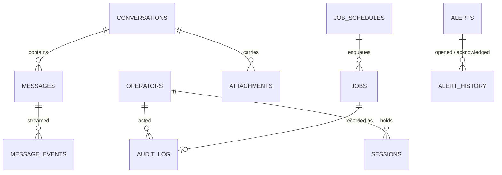

# WeightRoomGym — Data Model

**Database:** `weightroom.sqlite3` (or PostgreSQL), owned exclusively by WeightRoomGym. One Alembic
history; no package table is mounted. **Every other application's database is read, never
owned** — the read side is §4.
**Conventions:** [Database Standards](../../standards/database-standards.md).
**Derived from** spec §10; written before `infrastructure/db/models.py` exists and reconciled
to it at W1/W2.

---

## 1. Entity overview

`audit_log` is append-only and cascades from nothing: an operator row is never deleted (there is
one), and a deleted conversation or job keeps its audit rows. `messages` and `attachments` cascade
from their conversation.

## 2. Tables

### `operators`
| Column | Type | Notes |
|---|---|---|
| `id` | ULID pk | |
| `username` | text, unique | |
| `password_hash` | bytes | `hashlib.scrypt` output |
| `password_salt` | bytes | 16 random bytes |
| `kdf_params` | json | `{"n": 32768, "r": 8, "p": 1}`, stored so they can rise; a login under old params re-hashes |
| `created_at`, `password_changed_at` | timestamp | |

One row in 1.0 ([ADR-0126](../../adr/0126-weightroom-is-the-only-service-on-the-lan-and-terminates-tls-with-its-own-ca.md) rule 7); the shape admits more.

### `sessions`
| Column | Type | Notes |
|---|---|---|
| `id` | text pk | 32 random bytes, base64url; regenerated on login |
| `operator_id` | fk | |
| `created_at`, `last_seen_at`, `expires_at` | timestamp | idle 12 h from `last_seen_at`, absolute 7 d from `created_at`; the sweep deletes expired rows |
| `address` | text | the client address at login |
| `reauth_at` | timestamp, null | the last successful `POST /reauth`; a security action needs it within the window |

Index `(expires_at)`.

### `audit_log`
| Column | Type | Notes |
|---|---|---|
| `id` | ULID pk | |
| `operator_id` | fk, null | null for the job worker and the alert evaluator (`actor` says which) |
| `actor` | text | `operator` \| `job` \| `alerts` \| `cli` |
| `at` | timestamp | |
| `app` | text, null | `freeweight` … \| `weightroom` \| `ollama` \| `host` |
| `action` | text | `unit.start`, `settings.write`, `db.guarded_write`, `db.dry_run`, `db.query`, `db.curated`, `catalog.pull` (historical rows only, ADR-0146), `prompt.override`, `prompt.delete`, `job.run`, `job.enqueue`, `job.cancel`, `job.schedule`, `alert.ack`, `login`, `logout`, `tls.rotate`, … a closed vocabulary asserted by test |
| `target` | text, null | the unit, key list, table, model ref, prompt id, job id |
| `params` | json | redacted: tokens, passwords and URL credentials replaced before the row is written |
| `outcome` | text | `pending` \| `ok` \| `failed` \| `refused` |
| `message` | text, null | the failure or refusal text; on an `ok` or `pending` unit verb, the note that `systemctl` outlived its limit and what the unit was re-read as (row WPF4) |
| `backup_path`, `dry_run_count`, `actual_count`, `statement` | null | the [ADR-0124](../../adr/0124-a-raw-write-into-another-applications-database-passes-a-five-part-guard.md) condition-5 fields |
| `security` | bool | true for a security-key change or a guarded write (re-authenticated) |
| `request_id` | text, null | |

Append-only: no update path except `pending → ok|failed` on the row's own id. Indexes
`(at)`, `(app, at)`, `(action, at)`.

### `conversations`
| Column | Type | Notes |
|---|---|---|
| `id` | ULID pk | |
| `backend` | text | `loadcoach` \| `promptcadence` — a check constraint; no third value |
| `title` | text | |
| `task_profile` | text, null | LoadCoach |
| `model_override` | text, null | LoadCoach; the canonical ref |
| `classification` | text, null | PromptCadence; `public` \| `internal` \| `confidential` |
| `tier` | text, null | PromptCadence pin |
| `tools` | json, null | PromptCadence allowlist |
| `remote_trajectory_id` | text, null | the PromptCadence trajectory this conversation drives, once submitted |
| `created_at`, `updated_at` | timestamp | |

### `messages`
| Column | Type | Notes |
|---|---|---|
| `id` | ULID pk | |
| `conversation_id` | fk cascade | |
| `sequence` | int | unique with `conversation_id` |
| `role` | text | `user` \| `assistant` \| `system` |
| `text` | text | the final text; assistant rows hold the answer, never the thinking |
| `thinking` | text, null | the collapsed thinking, kept for expand-on-click |
| `routing` | json, null | LoadCoach's decision summary (`job_id`, `model`, candidates, rejections) |
| `usage` | json, null | token classes as reported; `null` never becomes `0` |
| `cost` | json, null | `{"money": …, "currency": …, "unpriced_count": n}` or null for local |
| `remote_job_id`, `remote_step_id` | text, null | LoadCoach job / PromptCadence step |
| `finish_reason` | text, null | |
| `created_at`, `completed_at` | timestamp | |

### `message_events`
The persisted SSE stream of one assistant message ([ADR-0044](../../adr/0044-a-state-change-and-its-event-are-one-write.md)):
`id`, `message_id` fk cascade, `sequence`, `kind` (`delta.thinking`, `delta.text`,
`thinking_done`, `plan`, `step`, `tool_call`, `egress_decision`, `approval_pending`, `halt`,
`done`), `payload` json, `at`. Replay is by `(message_id, sequence)`. Deltas are coalesced on
completion into `messages.text`/`thinking` and the delta rows dropped; the structured rows stay.

### `attachments`
`id`, `conversation_id` fk cascade, `filename` (sanitised), `stored_path` (under
`<data>/attachments/<conversation>/<ulid>`), `media_type` (`text/plain` \| `text/markdown`),
`size_bytes`, `sha256`, `created_at`.

### `jobs`
| Column | Type | Notes |
|---|---|---|
| `id` | ULID pk | |
| `kind` | text | `freeweight_suite_run` \| `retention_trim` \| `backup` \| `model_refresh` \| `catalog_pull` (historical rows only, ADR-0146) \| `docs_index` \| `self_restore` ([ADR-0136](../../adr/0136-weightroom-restores-its-own-database-through-a-job-handed-to-a-transient-unit.md)) |
| `params` | json | validated per kind, defaults filled in (`domain/jobs.validate_params`) |
| `state` | text | `queued` \| `running` \| `completed` \| `failed` \| `cancelled` — a check constraint |
| `schedule_id` | fk, null | `ON DELETE SET NULL` |
| `attempt` | int | incremented by the claim, its only writer (no in-lease retry here, so ADR-0029 §2's collision cannot arise) |
| `lease_expires_at` | timestamp, null | [ADR-0029](../../adr/0029-queue-mechanics.md) shape; a lease keeper thread — never the worker — renews it every `lease_seconds / 3` |
| `cancel_requested_at` | timestamp, null | the flag a cancel sets on a running job; its executor stops on it (row W9). A queued job is cancelled outright |
| `queued_at`, `started_at`, `finished_at` | timestamp | |
| `output` | text, null | captured stdout/stderr, capped at `jobs.output_cap_bytes` |
| `error` | text, null | |
| `audit_id` | fk, null | |

Indexes `(state, lease_expires_at)`, `(kind, queued_at)`.

### `job_schedules`
`id`, `kind`, `params` json, `cron` (five-field, evaluated in UTC), `enabled`, `next_run_at`,
`last_run_at`, `last_job_id` (no foreign key — `jobs.schedule_id` already points here), `created_at`.
Index `(enabled, next_run_at)`. Five schedules — `backup`, `retention_trim`, `model_refresh`,
`freeweight_suite_run` (with no model, so it cannot be enabled until one is set) and `docs_index` —
are seeded **disabled by migration `0006`**, not by the wizard, so an installation set up before
row W9 has them too. A due schedule fires once however many slots it missed; disabling clears
`next_run_at`, so a re-enabled schedule does not catch up on the time it was off.

### `alerts`
| Column | Type | Notes |
|---|---|---|
| `id` | ULID pk | |
| `source` | text | `app_down` \| `memory_cap` \| `gpu_thermal` \| `budget_ceiling` \| `breaker_open` |
| `subject` | text | the unit, the GPU index, the ledger scope, the model ref |
| `severity` | text | `warning` \| `critical` |
| `opened_at`, `last_seen_at` | timestamp | `last_seen_at` and `detail` move while a condition stays true |
| `acknowledged_at`, `acknowledged_by` | null | the operator's username; `cli:<user>` from the terminal |
| `cleared_at` | timestamp, null | a condition source found the subject right again |
| `closed_at` | timestamp, null | null while the episode is **active**: set when a condition clears, or when an event (`memory_cap`) is acknowledged ([ADR-0137](../../adr/0137-an-alert-is-an-episode-a-condition-clears-itself-an-event-waits-for-acknowledgement.md)) |
| `detail` | json | the evidence (journal line, temperature, balance and ceiling) |

At most one **active** alert per `(source, subject)`: the partial unique index
`uq_alerts_source_subject_active` (`WHERE closed_at IS NULL`, both dialects). Closing sets
`closed_at` on the row; a row is never deleted. An acknowledged condition stays active, off the
banner, until it clears.

### `alert_history`
`id` (ULID), `alert_id` fk, `event` (`opened` \| `seen` \| `acknowledged` \| `cleared`, a check
constraint), `at`, `detail`. Indexes `(alert_id, at)`, `(at)`. `seen` is written for an event
source's further line only; a condition that stays true moves its alert's `last_seen_at` instead
of writing a row every evaluation (ADR-0137 rule 6).

### `telemetry_samples`
`at`, `interval_ms`, one column per figure the strip shows (nullable — NULL is unavailable,
never 0), `gpu_index`, `resident_json`. Retained `telemetry.history_hours`; rows older than an
hour are downsampled to one per minute by the sweep. Index `(at)`.

### `docs_index`
An FTS5 virtual table: `path`, `title`, `body`, tokenised; rebuilt by `wr-gym docs index`
and the `docs_index` job. On PostgreSQL a `tsvector` column on a plain table with the same
columns; the search service hides the difference.

### `known_revisions`
Seeded per release: `app`, `revision`, `weightroom_version`, `notes`. The map [ADR-0123](../../adr/0123-weightroom-is-a-host-operator-tool-above-the-layer-rules.md)
rule 3 compares against; a revision not present degrades that application's database pages.

### `settings`
Runtime-changeable rows, `key`/`value`/`updated_at`, ADR-0100's shape.

## 3. Retention

* `sessions`: expired rows swept every minute.
* `audit_log`: kept for ever. The operator's record is not retention's business.
* `message_events`: deltas coalesced on completion; structured rows kept with the message.
* `telemetry_samples`: `telemetry.history_hours`.
* `jobs`: completed rows kept 90 days, then the row goes and the audit row stays.
* `alert_history`: kept for ever.

## 4. What WeightRoomGym reads elsewhere, and how

| Application | Read through | Tables read directly (read-only) | Writes |
|---|---|---|---|
| FreeWeight | API; CLI; `storage.database_url` from its schema document | `models`, `runs`, `run_tests`, `samples`, `metric_values`, `capability_evidence`, `runtime_profiles`, `machines`, `alembic_version` | curated verbs; guarded writes on non-locked tables |
| LoadCoach | API; CLI; database | `models`, `jobs`, `job_attempts`, `routing_decisions`, `routing_candidates`, `capability_evidence`, `reliability_stats`, `residency`, `alembic_version` | as above |
| IdeaPress | API; CLI; database | `projects`, `units`, `stage_runs`, `attempts`, `ledger_*` (via `loadledger.sql`), `egress_decisions`, `alembic_version` | as above |
| PromptCadence | API; CLI; database | `trajectories`, `turns`, `approval_requests`, `ledger_*`, `egress_decisions`, `alembic_version` | as above |

Every connection is opened read-only (`?mode=ro` / `default_transaction_read_only`); a guarded
write opens its own connection for one statement ([ADR-0124](../../adr/0124-a-raw-write-into-another-applications-database-passes-a-five-part-guard.md)).
The never-writable list is the ADR's table, held as data in `weightroom.domain.guard`.

## 5. Query-plan requirements

* Audit listing by `(app, at)` and `(action, at)`; never a full scan for the trail page.
* Job claim by `(state, lease_expires_at)`.
* Message replay by `(message_id, sequence)`.
* Telemetry history by `(at)` over one figure.
* Open-alert lookup by `(source, subject)`.
